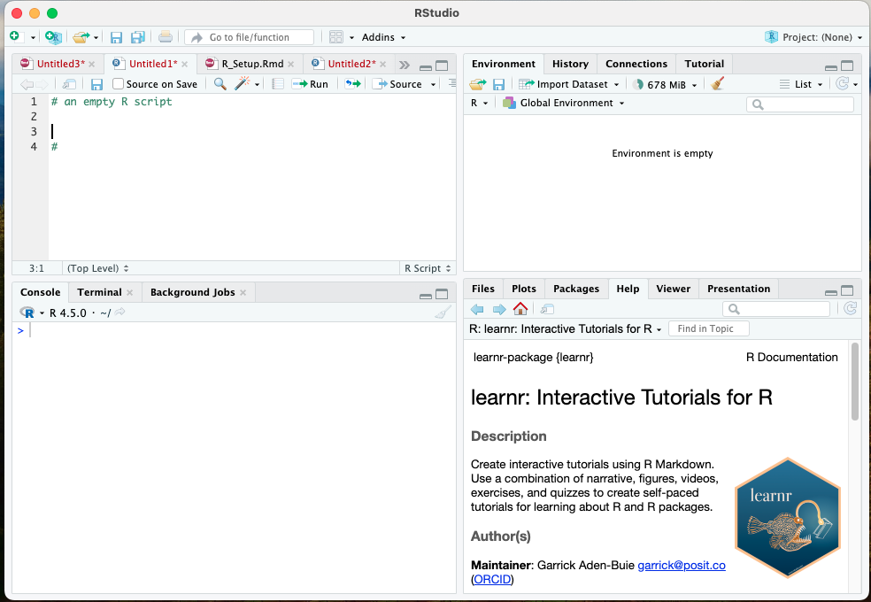

```{r setup, include=FALSE}
library(learnr)
library(tutorial.helpers)
options(repos = c(CRAN = "https://cran.rstudio.com"))
if (!requireNamespace("gradethis", quietly = TRUE)) {
  learnr::tutorial_warning(
    "This tutorial uses the **gradethis** package to provide feedback.  
    It looks like you don’t have gradethis installed yet.  
    Please run this in your console:
    
    remotes::install_github('rstudio-education/gradethis')"
  )
} else {
  library(gradethis)
  gradethis::gradethis_setup()  # optional: standardizes grading defaults
}
```

```{r info-section, child=system.file("child_documents/info_section.Rmd", package = "tutorial.helpers"),echo=F}
```

```{r copy-code-chunk, child=system.file("child_documents/copy_button.Rmd", package = "tutorial.helpers")}
```

## Introduction

In this tutorial, we will introduce some of the basics regarding `R` code and the `R` environment. We will also explain how to access and run tutorials for this class, as well as externally created tutorials that accompany the text *R for Data Science (2e)*. As a reminder, the book is available at this link [here](https://r4ds.hadley.nz).

`R` certainly has a learning curve to it, and it can be more complicated than other programs. This is because it is also very flexible and adaptable. `R` can accomplish complex and tedious computations in a few lines of code, but the tradeoff is that our code must be very precise. 

###

In the `R_Setup` tutorial, we learned about the general form of functions:

```{r,function1, eval=F}
functionName(argument1 = value1, argument2 = value2, and so on)
```

and we learned two very important functions: `install.packages()` and `library()`.

### Exercise 1

To reinforce what we've learned, let's load the `tidyverse` package below.

```{r load-library, exercise=TRUE}

```

```{r load-library-hint-1, eval = FALSE}
library(...)
```

```{r load-library-test, include = FALSE}
library(tidyverse)
```

###

We will install and use many different packages throughout the semester. Let's install a new one now called `r4ds.tutorials`. Complete the text below: 

```{r install-package, exercise=TRUE}

```

```{r install-package-hint-1, eval = FALSE}
install.packages("pkg_name_must_be_in_quotes")
```

```{r install-package-test, include = FALSE}
install.packages("r4ds.tutorials")
```

###

We will rely on this package in the early stages of the course. This package was written and recently distributed by David Kane:

Kane D (2025). r4ds.tutorials: Tutorials for "R for Data Science". R package version 0.3.2.9003, https://ppbds.github.io/r4ds.tutorials/.

## `R` and RStudio Basics

RStudio includes 4 windows:

- **The console** is where code is executed. Here, input and output are shown, and code can be written and executed directly
- **script** or syntax editor. Here we write longer lines of code and then send all or part of the script to the console to run it.
- The RStudio **Environment** which shows available data, saved objects, functions, script history, and **includes a tutorial tab**
    - Environment also includes `Import Dataset` button, a point-and-click convenience function for reading in data
- **utility** pane, which can show plots, tables, help windows, and file paths

{width=80%}


### Objects


Data analysis in `R` often invoves long series of codes with multiple functions that build on each other and multiple things (e.g., variables) that we perform those functions on.

Thankfully, `R` is an object-oriented coding language, meaning we can create placeholders called **"objects"** that store data, functions, or even the result of functions. 

###

To create an object, we use the *assignment* operator, `<-`. The assignments have the form of 

```{r, eval=F}
object <- value
```

The assignment operator is read as "gets", as in, "the `object` **gets** this `value`.

###

Here is an example. In the code chunk below, type `8 + 5` and run code. This is equivalent to running this math once in the `R` console. 

```{r math1, exercise=TRUE}

```


```{r math1-hint-1, eval=F}
8 + 5
```


###

The result of the function (the `+` is a math function) is printed in the console; however, if we wanted to do the calculation a second time, we'd have to re-type `8 + 5`. Instead, we can assign the number 13 to an object:

```{r, object1, exercise=T}
thirteen <- 13
```

(be sure to hit "Run Code")

### 

Now if we call this object in the console or by running code, it will output what is stored in the object - namely, the number 13.

```{r, object2, exercise=T, exercise.setup = "object1"}
thirteen
```
###

We can also assign the result of a function, such as `8 + 5`, to an object. 


```{r math2, exercise=TRUE}
thirteen <- ...
thirteen
```

To make a short story long, `R` recognizes `8` and `5` as `numeric` objects, and the `+` is a function that performs addition to numeric objects. The result is the number thirteen, which is saved in the assigned object `thirteen`. This is why it does not simply print out `8 + 5`. 

###

`R` is very sensitive to the type of variable or input that it is receiving. The most common types are 

- `numeric` (also called `double` or `dbl`), 
- `factor` or `fct`, and 
- `character` or `chr`. 

For example, we can tell `R` that the variable is a character by using quotations. Run the following to see the difference: 

```{r math3, exercise=TRUE}
thirteen <- "8 + 5"
thirteen
```

Our reading assignment this week discusses other types of data in `R`. We will cover variable types and some of these coding quirks extensively throughout the semester. 

## Accessing Tutorials

We will use tutorial modules like this one as the bulk of our content throughout the semester. There are a suite of pre-built tutorials in the `r4ds.tutorials` package and the `learnr` package. Additionally, I will create tutorials that can be accessed through a custom `R` package shared through GitHub. 

As a reminder, we isntalled the following packages when following the `R_Setup` tutorial. If you have not already, be sure to type or copy/paste this code onto your local RStudio console and make sure it runs. 

```{r, eval=F}
install.packages("learnr")
install.packages("remotes")
install.packages("tutorial.helpers")
#install.packages(r4ds.tutorials) already completed previously
```

Typically, the tutorial scripts will also load any necessary packages, but it is useful to have all packages installed locally, just in case. 

### Launching tutorials

To launch a tutorial on your own computer (laptop or lab PC), we will use a function from `learnr` that is called `run_tutorial()`. In this function, you will provide the name of the tutorial and the name of associated package. Here is an example: 

```{r, eval=F}
learnr::run_tutorial("rstudio", package = "tutorial.helpers")
```

###

As an aside, this specific syntax above with the double colon `::` is a special use where we call a function from a specific package without loading the entirety of the package into the active library. In other words, `learnr` is installed, but you do not have to run `library(learnr)` to access the `run_tutorial()` function when it is written this way. 

Each time a tutorial is assigned, I will provide the one-liner code needed to open it. 

### `r4psych.tutorials`

I have also created a custom package containing tutorials, exercises, and homework assignments for this class. To access tutorials for additional content or assignments in our course, you will need to download my package from GitHub. The package is called `r4psych.tutorials`. Always install the latest version before launching a new tutorial or assignment module. To install, run: 

```{r, eval=F}
remotes::install_github("luningham-lab/r4psych.tutorials", force=TRUE)
```


###

To walk through this code: 

- `remotes` is an additional package that can access content from the Web. 
- `install_github` is a function that will install `R` packages that are uploaded to the website GitHub and not necessarily available on the Comprehensive `R` Archive Network (CRAN). Packages can be updated and distributed much quicker through GitHub than CRAN. 
- `luningham-lab` is my GitHub account, and this directs the `install` function to the correct user's library to find the package.
- `force=TRUE`: argument to ensure the latest version is installed 

### 

This package is a living and breathing entity, so it will be important that you re-install it with the above code frequently.

Now you can load tutorials from this package (again, code will be provided):

```{r, eval=F}
learnr::run_tutorial("module1", package = "r4psych.tutorials")
```

## Knowledge Check 

Suppose we need to use a new package for our research, such as the `psych` package. In the code chunk below, write both lines of code needed to install the package and then load it into the active library. 

```{r knowledgecheck1, exercise=TRUE}


```

### Question 2

In the RStudio IDE, what is the difference between the syntax editor window and the console window?

```{r knowledgecheck2, echo=F}
question_text(NULL,
	answer(NULL, correct = TRUE),
	allow_retry = TRUE,
	try_again_button = "Edit Answer",
	incorrect = NULL,
	rows = 5)
```

### Question 3

What is the purpose/usage of the assignment operator, and what is its symbol?

```{r knowledgecheck3, echo=F}
question_text(NULL,
	answer(NULL, correct = TRUE),
	allow_retry = TRUE,
	try_again_button = "Edit Answer",
	incorrect = NULL,
	rows = 5)
```

### Question 4

Below, assign a number to the object `x1` and another number to the object `x2`. Then, assign their sum to the object `y`. Examine `y` (run it on its own line) to make sure everything executed as expected.  

```{r knowledgecheck4, exercise=TRUE}


```

### Question 5

```{r quiz1, echo=FALSE}
quiz(caption = "Tutorials and GitHub Packages",
  question("What function will launch a tutorial from an installed package?",
     answer("library(tutorial_name)", message = "No, the tutorial itself is not a standalone package"),
    answer("tutorials(tutorial_name, package name)"),
    
    answer("learnr::run.Tutorials(\"tutorial_name\", package=\"package\") ", message="not quite - R is very particular about exact symbols and letter case."),
    answer("learnr::run_tutorial(\"tutorial_name\", package=\"package\") ", correct=T),
    allow_retry = TRUE
  ),
  question("How can we install/update the class package from GitHub?",
answer("library(r4psych.tutorials)", message = "This will load the previously downloaded version, but it won't install or update the cotents of the package."),
    answer("GitHub::install.packages(\"r4psch.tutorials\")"),
    answer("remotes::install.packages(\"r4psch.tutorials\")", message="not quite - install.packages is from base R, not from the remotes package, and we need to tell R the specific user's library to find the package."),
    answer("remotes::install_github(\"luningham-lab/r4psych.tutorials\")", correct=T),
    allow_retry = TRUE
  )
)
```

## More about tutorials

In each tutorial, there will be a set of exercises for you to complete. For non-coding questions, you write your answer and then hit the "Submit Answer" button. 

For coding questions, make sure to hit "run code". Some browser windows will show a red or gray circle with diagonal when you hover your mouse over "run code", but if you click, it should still work. 


### 

Clicking **"Start Over"** --- small letters at the bottom of the left-hand side menu --- deletes all your work and allows you to begin the entire tutorial again. 

If you don't click **"Start Over"**, all of your work will be saved - even if you exit out of the tutorial in the middle.

###

The tutorials may load in the "Viewer" or "Tutorial" tab of RStudio, or they may launch in a new window. In a new window, the table of contents and extra buttons are more visible, so that is typically preferred.

###

You will often be askd to execute an `R` command in the `R` Console, the tab on the left portion of your RStudio screen. Type `version[['version.string']]` into the Console and hit the return/enter key.

Do not just type the command into the answer box! You must type or paste the command into the R Console and then execute the command.

Copy/paste the command and the result into this box.

```{r exercises-5, echo=F}
question_text(NULL,
	answer(NULL, correct = TRUE),
	allow_retry = TRUE,
	try_again_button = "Edit Answer",
	incorrect = NULL,
	rows = 3)
```

###

I'll typically provide example answers after you submit your own response. Don't be concerned if your submitted answer differs from the example below.

````
> version[['version.string']]
[1] "R version 4.5.0 (2025-04-11)"
>
````

###

Tutorial workflows will often look like this. You will be asked to run a command **in the Console**, generally in your main RStudio window. You run it, then you copy/paste both the command itself and the response returned directly in the console. This instruction to **c**opy/**p**aste the **c**ommand/**r**esponse is so common, it is often abbreviated CP/CR.

###

RStudio and your R installation have some default settings which are not good for new users. Run this command at the Console to change them:

`tutorial.helpers::set_rstudio_settings()`

CP/CR.

```{r exercises-6, echo=F}
question_text(NULL,
	answer(NULL, correct = TRUE),
	allow_retry = TRUE,
	try_again_button = "Edit Answer",
	incorrect = NULL,
	rows = 3)
```

###

The output from this function will report the changes, if any, which were made. To learn more, look up the help page by running `?set_rstudio_settings` in the Console.

###

At the end of every tutorial, you will save your work, and often you will submit it via TCU Online. This will always appear in a tutorial section labeled “Download answers.” 

After hitting the “Download” button, you will be prompted to save a file named `rstudio_answers.html`. This file will be saved in the default Downloads folder on your computer.

In most cases, you can use the default file name, which will usually be of the form `name-of-tutorial` + `_answers` + `.html.`

```{r download-answers, child=system.file("child_documents/download_answers.Rmd", package = "tutorial.helpers"),echo=F}
```
