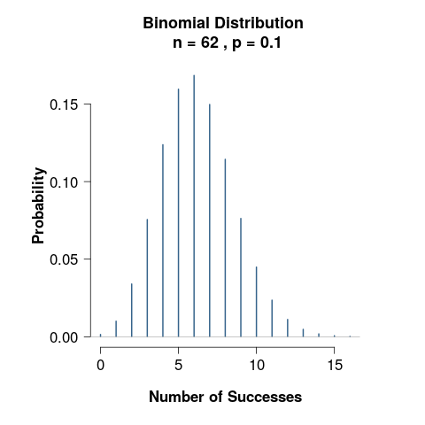
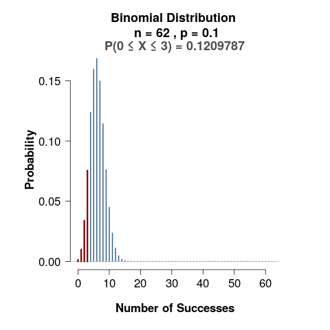
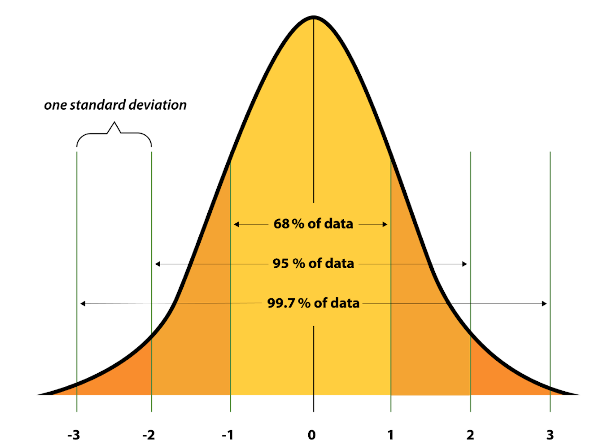

```{r setup, include=FALSE}
knitr::opts_chunk$set(echo = FALSE)
library(tidyverse)
library(infer)
library(moderndive)
library(learnr)
library(report)
library(rempsyc)
library(broom)
library(data.table)
library(flextable)
library(tutorial.helpers)
options(repos = c(CRAN = "https://cran.rstudio.com"))
if (!requireNamespace("gradethis", quietly = TRUE)) {
  learnr::tutorial_warning(
    "This tutorial uses the **gradethis** package to provide feedback.  
    It looks like you don’t have gradethis installed yet.  
    Please run this in your console:
    
    remotes::install_github('rstudio-education/gradethis')"
  )
} else {
  library(gradethis)
  gradethis::gradethis_setup()  # optional: standardizes grading defaults
}

set.seed(144445)
one_sample <- tibble(first_walk = round(rnorm(50, 12.8, 2.5),1))

library(MASS)

raw_pairs<-mvrnorm(25, mu = c(14, 12.8), Sigma = cbind(c(2.5, 1), c(1, 2.5)))

paired_samples <- tibble(sib1 = round(raw_pairs[,1],1), sib2 = round(raw_pairs[,2],1), famID=1:25)

paired_long <-paired_samples |> pivot_longer(cols = c(sib1, sib2), values_to = "first_walk", names_to = "sibling")

two_sample<-tibble(control = round(rnorm(50, 14, 2.5),1), intervention = round(rnorm(50, 13, 2.5 ),1))
```


```{r info-section, child = system.file("child_documents/info_section.Rmd", package = "tutorial.helpers")}
```


## t-test overview
###

One of the most common tests in statistics, the t-test, is used to determine whether the means of two groups are equal to each other. The assumption is that both groups are sampled from normal distributions with equal variances. 

The null hypothesis is that the two means are equal, and the alternative is that they are not. Sometimes, we may specify a particular direction in the alternative hypothesis (e.g., the treatment group has lower cholesterol scores than placebo in a clinical trial of a drug that reduces cholesterol). 

###

Let's consider a motivating example throughout this module. The average age that children start walking is 14 months old. Three researchers propose that intensive music therapy leads to earlier walking times in children. The three researchers design three different studies to test this therapy.

Researcher 1 will follow one group of babies given the therapy regimen. Their age at first walking is recorded. The researcher will compare the average walking time of this group to the average age in the population. 

###

Researcher 2 points out that this design above is too susceptible to chance, and the individual differences in walking time are highly heritable. To control for this, the researcher will study siblings from the same family – one who receives the therapy and one who does not. The age at first walking is recorded for both siblings. This partially controls for genetic differences. 

###

Researcher 3 notes that siblings are raised by the same families, so the shared environment may mitigate or exacerbate the effects of the therapy. They propose a true randomized trial in which a larger group of children are randomly assigned to receive the therapy or placebo, and these two groups are compared.

###

All three of these designs involve making mean comparisons. Does anyone recall the three **types** of t-tests that one can conduct?

```{r quiz1, echo = FALSE}
question_text("The three types of t-tests are___",
	answer(NULL, correct = TRUE),
	allow_retry = TRUE,
	try_again_button = "Edit Answer",
	incorrect = NULL,
	rows = 3)
```

### 

Before we proceed, let's consider the logic of hypothesis testing for mean comparisons. 

Suppose we conducted the Researcher 1's study above following $N = 50$ children exposed to the music therapy regimen. These children had an average age of first walking of 13.1 months. This sample mean is less than the population mean of 14 months, but is this a real effect? Or did this happen by chance? 

In other words, how plausible is it to observe a sample mean of 13.1 in 50 children if the true mean is 14? We are back to the null hypothesis testing framework! 

###

Previously, we learned about the sampling distribution of a proportion. There, the outcome was a discrete variable - the number of outcomes per a fixed number of samples (e.g., complications per 62 patients). We could calculate the probabilities of specific outcomes. 




###

The same principle applies to continuous outcomes. How do we know? 

Recall the core principles of the sampling distribution of the mean: it is normally distributed with sufficiently large samples, with a mean equal to the population mean and standard deviation that is $\frac{\sigma}{\sqrt{N}}$. 

### 

The *normal distribution* follows what's called a probability density function. When a random variable can be represented by a density curve, the probability that the random variable takes a value in any given interval (on the X-axis) is equal to the area under the density curve for that interval.

{width=70%}


### 

For our example, we need to construct the sampling distribution under the null hypothesis. 

If the population average walking time is 14 months, then walking time in general is normally distributed with $N(14, \sigma)$ and the sampling distribution of average walking times taken from repeated samples is $N(14, \sigma/\sqrt{N}$ 

But what is $\sigma$? 

### 

We don’t know! Instead, we use the estimated sample standard deviation as a stand-in for population standard deviation. However, this adds some uncertainty to our sampling distributionm so we change the shape of our sampling distribution to be more conservative in our hypothesis test. 

Instead of a normal distribution, it follows a t-distribution, which is like a normal distribution but with more area in the tail ends depending on the sample size (or, degrees of freedom). 

```{r, echo = F, warning = F, message = F}
x_range <- data.frame(x = c(-4, 4))


ggplot(x_range, aes(x = x)) +
  stat_function(fun = dt, args = list(df = 5), aes(colour = "t (df=5)")) +
  stat_function(fun = dt, args = list(df = 20), aes(colour = "t (df=20)")) +
  stat_function(fun = dnorm, aes(colour = "Normal"), linetype = "dashed") +
  labs(title = "Comparison of t-distributions and Normal Distribution",
       x = "x-value",
       y = "Density",
       colour = "Distribution") +
  theme_minimal()
```

The degrees of freedom equal the total sample size minus the number of things we estimate. For a one-sample test, we estimate one mean, so DF = N – 1. 

### 

Back to our example. Suppose that our sample standard deviation was 2.5 and the null hypothesis is $\mu = 14$. Then, the sampling distribution of $N = 50$ samples follows a distribution of $N(14, 2.5/\sqrt{50})$: 

```{r, echo =F, warning = F, message = F}
x_range <- data.frame(x = c(12, 16))

# Create the plot using stat_function for each distribution
ggplot(x_range, aes(x = x)) +
  stat_function(fun = dnorm, args = list(mean=14, sd = 0.3535), aes(colour = "Normal")) +
  labs(title = "Comparison of t-distributions and Normal Distribution",
       x = "sample means",
       y = "Density",
       colour = "Distribution") +
  geom_segment(x = 13.1, xend = 13.1, y = 0, yend = .041) +
  annotate(x = 12.7, y = 0.07, geom = "text", parse = TRUE, label = "bar(x) == 13.1")+
  theme_minimal()
```

### 

We can calculate the probability under the curve of observing a $\bar{x} \leq 13.1$ under the null. This is the interpretation of the **p-value** for our test! 


## Executing t-tests
###

The prior page describes what goes on "under the hood" for our t-tests. Let's actually run some tests. 

Recall that for researcher 1, we have a single sample of 50 children, so we conduct a one-sample test. The one-sample tests are less common in practice, but our researcher here feels pretty confident that the general population mean for starting walking is 14 months. 

### 

The code for t-tests in `R` is pretty straightforward: we can execute a one-sampe with the base function `t.test()`, which takes the following arguments: 


| Argument       | Description         |
| ------ |---------------| 
| `x`     | A vector of data whose mean you want to compare to the null hypothesis `mu` | 
| `y`     | **Optional** second vector of data for paired or two-sample tests | 
| `mu`     | The population mean under the null hypothesis. For example, `mu = 0` will test the null hypothesis that the true population mean is 0.     |  
| `alternative` | A string specifying the alternative hypothesis. Can be `"two.sided"` indicating a two-tailed test, or `"greater"` or `“less"` for a one-tailed test.      |  
| `paired` | `TRUE` or `FALSE`. `TRUE` if conducting a paired samples t-test. Both vectors must be ordered by pairs. Default is `FALSE`     |  

###

The data are already in the tutorial environment and called `one_sample`. First, glimpse the data.

```{r test1, exercise = TRUE}
___(one_sample)
```

### 

Age when walking is called `first_walk`. Because `t.test()` takes a vector and not a dataset, we can extract that variable using the `$` operator. To signal that this is a one-sample test, we provide the population mean under the null hypothesis. 

```{r test2, exercise = TRUE}
t.test(one_sample$first_walk, 
       mu=___)
```

###

The output is not a numerical summary, but more of an explanation with text and numbers combined. The `t` is called the test statistic, it is the standardized value of how different our sample mean is from the null mean. `df` is the degrees of freedom, determining the shape of the `t` distribution. The `p-value` is the probability of seeing a sample mean of 12.75 if the null is true. The output spells out the alternative hypothesis and also provides a 95% CI for the sample mean. 

### Making Nice Output

This output is useful, but we will look at some additional tricks for creating publication-ready outputs here. We will use a package called `broom`, which creates "tidy" output from a wide range of analyses, and the package `rempsyc`: 

Thériault, R., (2023). rempsyc: Convenience functions for psychology. *Journal of Open Source Software*,
  *8*(87), 5466. https://doi.org/10.21105/joss.05466 

We will only use the `nice_table` output from this package, but it has many other convenience functions. 

### 

First, load the `broom` library, then wrap our `t.test` code from before in the function `tidy()`:

```{r test3, exercise = TRUE}
library(___)
t.test(one_sample$first_walk, mu=14)
```

We get similar information, but it is organized into columns of a results table. Quite nice! 

However, if I'm making a publication-ready table, I want to clean up some of the names. Use `rename()` from `dplyr` to fix a few column names. Let's be sure to assign the result as well: 

```{r test4, exercise = TRUE}
clean_res <- tidy(t.test(one_sample$first_walk, mu=14)) |> 
  rename(`Sample mean` = estimate, `t-statistic` = statistic, DF = parameter )
clean_res
```

### 

Now we will pipe this to a function called `nice_table()` after loading `rempsyc`. 

```{r test5, exercise = T, exercise.setup = "test4"} 
library(___)
clean_res |> nice_table()
```

### Exporting to Word

You could use `select` to remove or re-order the columns as needed. 

We can also export the nice table directly to Word. 

```{r test6, exercise = TRUE, exercise.setup = "test4"}
nice_res <- clean_res |> nice_table()
print(nice_res, preview = "docx")

# Save in Word
flextable::save_as_docx(nice_res, path = "one_sample.docx")
```

### Paired samples

Moving on to researcher 2. They are studying 50 siblings paired within the same family (25 pairs, i.e. 25 families), with one sibling randomly assigned to receive the music therapy. (Ignore the logistical nightmare of actually executing this study prospectively...)

This researcher will used the paired-samples t-test. While we still have 50 observations, the observations are not independent. However, the 25 different *pairs* are independent from each other. 

Let's re-think our null hypothesis for this design. If the null is true, then the average time of first walking should be the same for both siblings, regardless of receiving therapy or not. If the alternative is true, then they are not equal. This could be written as $$H_0: \mu_{sib1} = \mu_{sib2}$$ 


### 

In the unique case of paired samples, we could also reconfigure the null hypothesis. If there is no effect of therapy, then the average difference between the intervention and control sibs in a pair should be 0. Any difference between them will be due to random factors, and it is random if the treated sibling walks sooner or later than their pair, so the random differences balance out in the long run. In this case, we can calculate a difference score $d$ for each pair, and the null hypothesis is

$$H_0: \mu_d = 0 $$
###

In other words, for the paired samples t-test, we conduct the test on difference scores. The sampling distribution used for calculating the p-value is the distribution of average difference scores across samples, and the standard error is $SD_{d}/\sqrt{N_{pairs}})$

###

To run in `R`, we provide two different vectors to the `t.test()` function, and we don't need to specify the population `mu` value. We add the extra argument `paired = TRUE`. Both vectors must be in the same order for the pairs to be aligned. 

The data are called `paired_samples`. First, glimpse the data.

```{r paired1, exercise = TRUE}
glimpse(___)
```

###

Before we test, let's conduct some exploratory data analysis. Calculate the mean and SD for each sibling. 

```{r summ_stat, exercise = TRUE}
paired_samples |> 
  ___

```

The two vectors are called `paired_samples$sib1` and `paired_samples$sib2`. It's important to note that in these data, `sib1` is the control sibling and `sib2` is the intervention sibling. Even though the order was randomized within family, the intervention and control observations must be correcty aligned in the data.

Add the two vectors for analysis to the `t.test` function with `paired = TRUE`. 

```{r paired2, exercise = TRUE}
t.test(___)
```

###

Once again, let's create a `tidy` result and output it with `nice_table`. 

```{r paired3, exercise = TRUE}
clean_pairs <- tidy(t.test(___))|> 
  rename(`Sample mean` = estimate, `t-statistic` = statistic, DF = parameter )

clean_pairs |> nice_table()
```

### 

How do we interpret the sample mean of 1.85? 

### Next time 

We will analyze the data from Researcher 3's study and examine t-test assumptions through plots. 

```{r download-answers, child = system.file("child_documents/download_answers.Rmd", package = "tutorial.helpers")}
```
