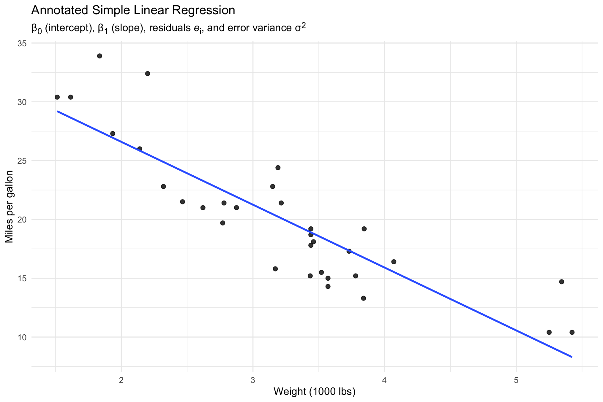
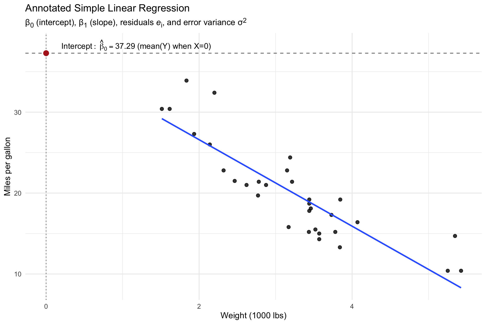
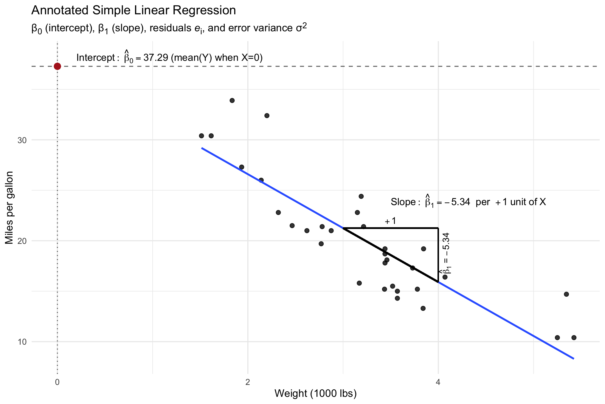
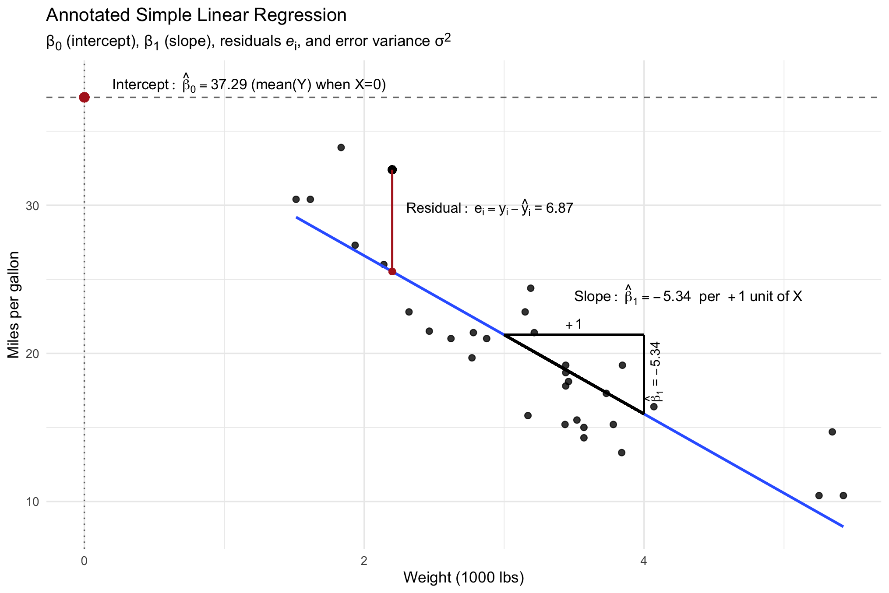
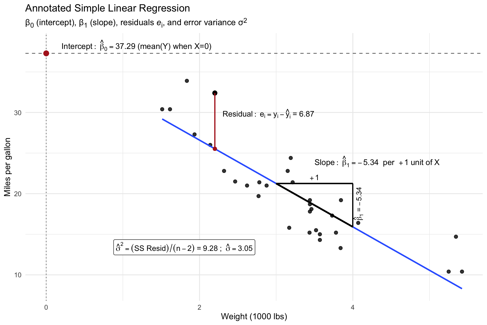
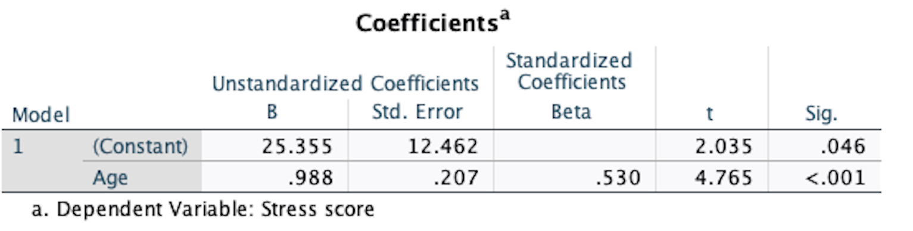
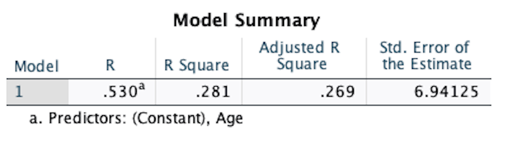
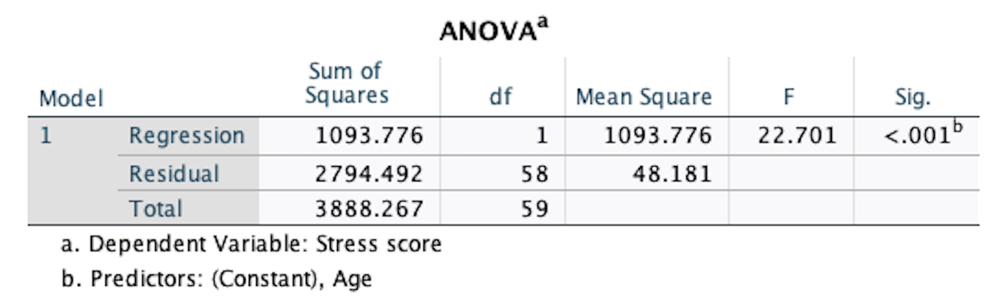

```{r setup, include=FALSE}
knitr::opts_chunk$set(echo = FALSE)
library(MASS)
library(jtools)
library(infer)
library(moderndive)
library(learnr)
library(report)
library(rempsyc)
library(broom)
library(data.table)
library(flextable)
library(rstatix)
library(ggpubr)
library(tidyverse)
library(tutorial.helpers)
library(datarium)
library(GGally)
options(repos = c(CRAN = "https://cran.rstudio.com"))
if (!requireNamespace("gradethis", quietly = TRUE)) {
  learnr::tutorial_warning(
    "This tutorial uses the **gradethis** package to provide feedback.  
    It looks like you don’t have gradethis installed yet.  
    Please run this in your console:
    
    remotes::install_github('rstudio-education/gradethis')"
  )
} else {
  library(gradethis)
  gradethis::gradethis_setup()  # optional: standardizes grading defaults
}

set.seed(144445)
one_sample <- tibble(first_walk = round(rnorm(50, 12.8, 2.5),1))
raw_pairs<-mvrnorm(25, mu = c(14, 12.8), Sigma = cbind(c(2.5, 1), c(1, 2.5)))

paired_samples <- tibble(sib1 = round(raw_pairs[,1],1), sib2 = round(raw_pairs[,2],1), famID=1:25)

paired_long <-paired_samples |> pivot_longer(cols = c(sib1, sib2), values_to = "first_walk", names_to = "sibling")

two_sample<-tibble(control = round(rnorm(50, 14, 2.5),1), intervention = round(rnorm(50, 13, 2.5 ),1))

two_sample_long <- two_sample |> 
  pivot_longer(cols = c(control, intervention), # or, cols = everything()
              values_to = "first_walk", names_to = "group")

#dat <- read_delim("~/Downloads/Tab10-2.txt", 
#    delim = "\t", escape_double = FALSE, 
#    trim_ws = TRUE)

attr(stress$score, "label") <- "Stress Score"
attr(stress$age, "label") <- "Age"
```


```{r info-section, child = system.file("child_documents/info_section.Rmd", package = "tutorial.helpers")}
```


## Regression Overview
###

Like correlation, regression is perhaps the most commonly used method in modern psychological research, and linear regression (AKA the general linear model) is the foundational building block for most methods you will encounter. 

Regression proposes a statistical model that defines the linear relationship between an outcome variable and one or more explanatory variables. When the regression model is estimated on real data, we usually have one of two purposes in mind:

###

1. For **inference** when we want to *explain* how changes in one or more explanatory variables are associated with changes in the outcome, quantify those changes, and determine which of the explanatory variables actually have a true association with the response. This is our typical use case in psychology.

###

2. For **prediction** when we want to forecast what the value of the outcome will be based on the observed values of the explanatory variables. In this case, we are not concerned about how each of the explanatory variables relate to the response or interact with each other, we simply want to create the most accurate predictions possible.

###

A note on terminology: you may have heard different terms to describe the different elements of a regression model. Many different terms have the same definition and are used interchangeably, with some specific terms more common in certain fields. Some statistical synonyms:

* **outcome**: dependent variable, criterion variable, response
* **explanatory variable**: independent variable, exposure variable, predictor, regressor

### 

*Linear* regression or the *general linear model* specifically refer to a model for a numeric/quantitative outcome. The distribution of the dependent variable is important in choosing our model. Regressors can be numeric or categorical. 

### The model

The simple regression model has only one regressor, and is written as 

$$Y_i = \beta_0 + \beta_1 X_i + \varepsilon_i$$ 

* $Y_i$ is the outcome for person $i$
* $\beta_0$ is called the intercept
* $\beta_1$ is the regression slope for the regressor $X$
* $X_i$ is the value of $X$ for person $i$
* $\varepsilon_i$ is the error term for person $i$

### 

Importantly, the errors in the population "balance out" around the regression line - some errors are positive, some are negative, but in the long run, they have a mean of zero. The errors have a constant amount of variability across the entire population. Technically: 

$$\varepsilon_i \sim N(0, \sigma^2)$$

### The estimates

The $\beta$'s and $\sigma^2$ are population parameters. When we "fit" a model to data, we obtain estimates: 

* $\hat{\beta_0}$ or $b_0$
* $\hat{\beta_1}$ or $b_1$
* $\hat{\sigma^2}$, "mean squared error"

### Quick `R` example

Purely for illustration, let's use the `mtcars` data to check the relationship between miles per gallon for a vehicle and the vehicle's weight. Like correlation, we can first explore this relationship visually: 

```{r car1, exercise = TRUE}
ggplot(mtcars, aes(x = wt, y = mpg)) +
    geom_point(size = 2, alpha = 0.8) +
  labs(
        x = "Weight (1000 lbs)",
        y = "Miles per gallon",
    ) +
    theme_minimal(base_size = 12)
```

### 

The function for regression is called `lm()` for "linear model". It requires two arguments: a `formula` of the form `y ~ x` and `data` for the dataset. Our outcome is `mpg` and our predictor is `wt`. 

```{r car2, exercise = TRUE}
lm(___,___)
```

###

This provides estimates to the data for the intercept and slope. The regression line is linear, like correlation, and looks like this:

{width=95%}

###

```
Coefficients:
(Intercept)           wt  
     37.285       -5.344  
```

The first value we get is the intercept, interpreted as the expected value (or mean) of $Y$ when $X$ is equal to zero. The intercept is scale-dependent and is not usually of interest by itself. Visually, the intercept is where the regression line hits the y-axis: 

{width=95%}

###

The slope is often what we want to interpret. The slope is the change in outcome $Y$ per one unit increase in $X$. In this example, the slope is negative, meaning MPG decreases as weight increases: 

{width=95%}

###

In a regression model, we also obtain a special new estimate, $\hat{y_i}$. This is the predicted score for person $i$ based on the estimates and their score on $x$:

$$ \hat{y_i} = \hat{\beta_0} + \hat{\beta_1} x_i $$ 

Here, a predicted value is denoted in red: 

{width=95%}


### The residual 

A "residual" is the simply the difference between an observed $y$ and a predicted $\hat{y}$. The residuals help us investigate if the model does a good job of explaining the data based on the total errors. 

{width=95%}

### 

However, the regression line is designed to be the best line that cuts through the "cloud" of data points exactly, meaning that over all data points, the amount of errors "above" and "below" the line balance out. i.e., the residuals of all data points sum to exactly zero! 

Instead, we use the sum of **squared** residuals to quantify the amount of error in the regression. This is often called sum of squared residuals or SSE for sum of squared errors, and is $\sum_{i = 1}^{n} (y_i - \hat{y}_i)^2$

###

The sum of squared residuals divided by the model degrees of freedom gives the **mean squared error**, which is our best estimate of $\sigma^2$. 

{width=95%}

### 

```{r, echo = F, warning = F, message = F, comment = "", include = F}
library(ggplot2)
library(broom)
library(dplyr)
library(ggtext)
## code to create annotated plot - for reference 
pm <- function(expr) as.character(as.expression(expr))

# --- Data and model ---
df  <- mtcars
fit <- lm(mpg ~ wt, data = df)

# Extract coefficients and variance estimates
b0 <- unname(coef(fit)[1])                 # intercept
b1 <- unname(coef(fit)[2])                 # slope
SSE <- sum(resid(fit)^2)
n   <- nrow(df)
dfR <- df.residual(fit)
sigma2_hat <- SSE / dfR
sigma_hat  <- sqrt(sigma2_hat)

# Augment data for plotting residuals
aug <- augment(fit)

# slope triangle interval (+1 in wt)
x0 <- 3
x1 <- x0 + 1
y0 <- b0 + b1 * x0
y1 <- b0 + b1 * x1

# Choose an example residual 
i_demo <- df |> filter(mpg == 32.4)
x_demo <- i_demo$wt
y_demo <- i_demo$mpg
yhat_demo <- b0 + b1 * x_demo
res_demo <- y_demo - yhat_demo


p <- ggplot(aug, aes(x = wt, y = mpg)) +
  geom_point(size = 2, alpha = 0.8) +
  geom_smooth(method = "lm", se = FALSE, linewidth = 1) +
  geom_segment(aes(x = wt, xend = wt, y = mpg, yend = .fitted), alpha = 0.5) +
  geom_hline(yintercept = b0, linetype = "dashed", alpha = 0.6) +
  geom_vline(xintercept = 0, linetype = "dotted", alpha = 0.6) +
  geom_point(aes(x = 0, y = b0), color = "firebrick", size = 3) +
  geom_segment(aes(x = x0, y = y0, xend = x1, yend = y0), linewidth = 0.7) +
  geom_segment(aes(x = x1, y = y0, xend = x1, yend = y1), linewidth = 0.7) +
  geom_segment(aes(x = x0, y = y0, xend = x1, yend = y1), linewidth = 1) +
  annotate("text",
    x = 0 +.2, y = b0 + 1, hjust = 0, parse = TRUE, size = 4,
    label = pm(bquote(Intercept: ~ hat(beta)[0] == .(round(b0, 2)) ~
                      "(mean(Y) when X=0)"))
  ) +
  annotate("text",
    x = x1 - 0.5, y = (y0 + y1)/2+5.4, hjust = 0, vjust = 0.5, parse = TRUE, size = 4,
    label = pm(bquote(Slope: ~ hat(beta)[1] == .(round(b1, 2)) ~
                      " per " ~ +1 ~ unit ~ of ~ X))
  ) +
  annotate("text",
    x = (x0 + x1)/2, y = y0 +1.1, vjust = 1, parse = TRUE, size = 3.8,
    label = pm(expression(+1))
  ) +
  annotate("text",
    x = x1 + 0.07, y = (y0 + y1)/2 +.2, angle = 90, vjust = 0.5,
    parse = TRUE, size = 3.6,
    label = pm(bquote( hat(beta)[1] ~ "=" ~ .(round(b1, 2))))
  ) +
  geom_point(aes(x = x_demo, y = y_demo), color = "black", size = 2.5) +
  geom_point(aes(x = x_demo, y = yhat_demo), color = "firebrick", size = 2) +
  annotate("segment",
    x = x_demo, xend = x_demo, y = y_demo, yend = yhat_demo, linewidth = 0.8, color = "firebrick"
  ) +
  annotate("text",
    x = x_demo +.1, y = (y_demo + yhat_demo)/2 + 0.9, hjust = 0,
    parse = TRUE, size = 3.9,
    label = pm(bquote(Residual: ~ e[i] == y[i] - hat(y)[i] ~ "=" ~ .(round(res_demo, 2))))
  ) +
  annotate("label",
    x = max(df$wt) - 0.7, y = min(df$mpg), hjust = 1,
    parse = TRUE, size = 3.8, label.size = 0.25,
    label = pm(bquote(hat(sigma)^2 == ("SS Resid")/(n - 2) ~ "=" ~ .(round(sigma2_hat, 2)) ~
                      ";" ~~ hat(sigma) == .(round(sigma_hat, 2))))
  ) +
  labs(
    x = "Weight (1000 lbs)",
    y = "Miles per gallon",
    title = "Annotated Simple Linear Regression",
    subtitle = "&beta;<sub>0</sub> (intercept), &beta;<sub>1</sub> (slope), residuals *e*<sub>i</sub>, and error variance &sigma;<sup>2</sup>"
  ) +
  theme_minimal(base_size = 12)+ theme(
  plot.subtitle = element_markdown()
)
#p
```


## More on `lm()` 
###

The result of `lm` is a special type of outcome called a model object. It only prints the estimates and summary info about the model. We can apply other functions to the model object to obtain detailed summary information. The two most important are `summary()` and `anova()`. 

To examine this, let's look at a different example. Let's revisit the `stress` data from the `datarium` package. As a reminder, we have the following columns:

- `id`: participant ID 
- `score`: final stress score
- `treatment`: `yes` = SKY, `no` = control 
- `exercise`: additional condition of exercise regimen, `low`, `moderate`, or `high`
- `age`: participant age 

### 

Let's test if there is any relationship between `age` and stress for these participants. Let's load the package, `glimpse` the data, and visualize the data first:


```{r stress1, exercise = TRUE}
library(datarium)
glimpse(stress)
```


```{r stress2, exercise = TRUE}
ggplot(stress, aes(x = age, y = score))+
  geom_point(alpha = .8) + 
  geom_smooth(method = "lm", se = FALSE)
```

### 

Let's now fit an `lm()` of stress `score` "regressed on" `age`. Assign our model to an object called `fit`. Then, provide `fit` as an argument to the `summary` function. 

```{r stress3, exercise = TRUE}
___ <- lm(___, ___)
___
```

```{r stress3-2, include= FALSE}
fit <- lm(score ~ age, stress)
```

###

There's a lot to interpret here, but you've probably seen most of these outputs when you ran regression in SPSS. Let's walk through it: 

###

* 5-number summary of the residuals: are they roughly symmetrical?

This one is not provided as default in SPSS.

```
Residuals:
     Min       1Q   Median       3Q      Max 
-14.8747  -5.7859   0.7786   5.7263  11.9618 
```

### 

* Coefficients: usually what we are most interested in. We get the estimates of intercept and slope, as before. How do we interpret the estimates?

```
(Intercept)          age  
    25.3551       0.9878  
```

### 

We also get a standard error, a t-value, and `Pr(>|t|)`. Calling back to hypothesis testing, the estimated regression coefficients are themselves sample statistics, and sample statistics follow a sampling distribution. The variability of that sampling distribution comes from the estimated mean squared error and the size of the sample. 

Under the null hypothesis, $H_0: \beta_k = 0$ for each $k$ regression parameter. 

The $t value$ is a test statistic, similar to when we conducted a $t$ test. The $t$ is the estimate divided by its standard error. It tells us how far the estimate is from the null mean $0$, based on a $t$ distribution scaled to the SE. 

###

`Pr(>|t|)` is the p-value of the test $H_0: \beta_k = 0$. It is the probability of observing a coefficient as or more different from zero if this sample were taken from a population where the true regression parameter is actually zero. 

pull up the summary one more time, and extract just the coefficients part with `$coefficients`: 

```{r stress4, exercise = TRUE, exercise.setup = "stress3-2"}
___(fit)$coefficients
```


```{r quiz1, echo = FALSE}
question_text("What interpretation and inferences can we make about the coefficients?",
	answer(NULL, correct = TRUE),
	allow_retry = TRUE,
	try_again_button = "Edit Answer",
	incorrect = NULL,
	rows = 3)
```

###

This information is identical to what's provided by SPSS:

{width=80%}

###

Finally, we also get the residual standard error, the degrees of freedom, the $R^2$, and the $F$ statistic. 

The residual standard error is the square root of the mean squared error we discussed before. If we calculated the predicted $\hat{y}$ for every point in the data, we could calculate 

$$SSE = \sum_{i=1}{^n}{(y_i - \hat{y_i})^2}$$
$$ MSE = \frac{SSE}{DF}$$
where DF is the total number of independent observations minus the amount of "things" we estimate. For simple regression, this is $N - 2$ because we estimate two things (intercept and slope). 

The MSE is our estimate of $\hat{\sigma^2}}$. The square root is $\hat{\sigma}$, which is the residual standard error given by `R` output. 

### 

The $R^2$ is the proportion of variance in $Y$ explained by the model as a whole. This information is also provided by SPSS: 

{width=80%}

You may recognize the $F$ statistic from when you learned ANOVA, but we didn't run an ANOVA here. What gives? Why is an $F$ reported here, and what does it mean? 

### 

The $F$ here tells us of the regression model as a whole significantly explains some of the variance in $Y$. In SPSS, we get this output:

{width=65%}

In `R`, we can get more information with `anova(fit)`:

```{r stress5, exercise = TRUE, exercise.setup = "stress3-2"}
anova(fit)
```

###

This tells us the overall sums of squares attributable to the `age` variable and SSE, MSE, and F. 

### Now what? 

Traditionally, we look at $p$-values and $R^2$ to assess if our model has interesting individual effects and overall does an ok job at explaining the outcome. However, we will soon see some methods that focus more on $\hat{y}$, residuals, and MSE. 

###

We previously defined the calculation of $\hat{y}$:

$$ \hat{y_i} = \hat{\beta_0} + \hat{\beta_1} x_i $$ 

In our example, the average age is about 60, so based on our estimates, the average person has a $\hat{y}$ of 

$$ 25.36 + 0.988 \times 60 = 84.64 $$ 

### 

$\hat{y}$ is referred to as the *predicted* value or the *fitted* value. 

There are numerous ways to extract the fitted values in `R` without programming the calculations ourselves. The simplest is `predict(lm.object)`. Provide our `lm` result to `predict()` below.

```{r predict1, exercise = TRUE, exercise.setup = "stress3-2"}
predict(___)
```

These are also stored in the model object itself: 

```{r predict2, exercise = TRUE, exercise.setup = "stress3-2"}
fit$fitted.values
```

### 

If we wanted to manually calculate the accuracy/inaccuracy of our model, we could also obtain residuals. We've learned many ways to program something like this, but here is a streamlined example:

```{r predict3, exercise = TRUE, exercise.setup = "stress3-2"}
stress |> mutate(residual = score - fit$fitted.values)
```

However, residuals are also stored in the `lm` object as well.

```{r predict4, exercise = TRUE, exercise.setup = "stress3-2"}
fit$residuals
```

### 

There are two other convenience functions that make post-model-fitting analysis a little easier. The first is `augment()` from the `broom` package. `augment()` takes the model object as its argument. 

```{r predict5, exercise = TRUE, exercise.setup = "stress3-2"}
library(broom)
augment(___)
```

The information contained here is

| Output       | Value       |
| ------ |---------------| 
| .cooksd	| Cook's distance, how much the model fitted values would change if that observation were removed |
| .fitted	|  Fitted or predicted value. |
| .hat	| Diagonal of the hat matrix. |
| .lower | Lower bound on interval for fitted values. |
| .resid	|  The difference between observed and fitted values. |
| .se.fit	| Standard errors of fitted values. |
| .sigma	| Estimated residual standard deviation when corresponding observation is dropped from model. |
| .std.resid	|  Standardised residuals. |
| .upper	|  Upper bound on interval for fitted values. | 


###

The second is `get_regression_points()` from the `moderndive` library. Its output is a little simpler. 

```{r predict6, exercise = TRUE, exercise.setup = "stress3-2"}
library(moderndive)
get_regression_points(___)
```

### 

How might we use the residuals? You may have heard of regression "diagnostic" plots previously, which are sometimes used for models with a few predictors. There are usually three things we might look for: 

1. unexpected residual patterns (checking for constant variance)
2. normally distributed residuals 
3. overly influential data points 

1 and 2 correspond to the assumption that $\varepsilon_i \sim N(0, \sigma^2)$ 

### Constant error variance

When we plot the residuals against the fitted values, we expect the residuals to have a mean of zero and constant variance across the range of fitted values. How might we plot this with `ggplot`?

```{r predict7, exercise = TRUE, exercise.setup = "stress3-2"}
augment(fit) |>
  ggplot(aes(x = .fitted, y = .resid)) +
  geom____() + 
  geom_hline(yintercept = 0, color = "darkred")
```

We want the scatterpoints to be approximately centered around 0 at the y-axis and to not display a pattern of increasing, decreasing, or widening/narrowing over the range of `x`. 

### 

We also sometimes plot the residuals against individual predictors to see which may contribute to any odd residuals, but in simple regression, this looks the exact same because we only have one predictor. 

```{r predict7-2, exercise = TRUE, exercise.setup = "stress3-2"}
augment(fit) |>
  ggplot(aes(x = age, y = .resid)) +
  geom_point() + 
  geom_hline(yintercept = 0, color = "darkred")
```

### Normality 

We can visually check for severe violations of normality with our Q-Q Plot using the `ggqqplot` function from `ggpubr`. 

```{r predict8, exercise = TRUE, exercise.setup = "stress3-2"}
library(ggpubr)
augment(fit) |> ggqqplot(x = ".resid")
```

### Influential data points 

Cook's d is a measure of the influence of each individual plot, quantifying how much the predicted values would change if a single datapoint were removed. 

Imagine we have an outlier data point, this can significantly alter the slope of the regression line: 

```{r, echo = F, message = F, warning = F, comment = ""} 
library(patchwork)
p1<-ggplot(stress, aes(x = age, y = score))+
    geom_point(alpha = .8) + 
    geom_smooth(method = "lm", se = FALSE)

stress2 <- stress
stress2[55, "score"] <- 120

p2 <- ggplot(stress2, aes(x = age, y = score))+
    geom_point(alpha = .8) + 
    geom_smooth(method = "lm", se = FALSE)

p1 + p2 + plot_annotation(title = "Linear association without (left) and with (right) outlier") + plot_layout(axes = "collect_y") & ylim(65, 120)&theme_pubr()
```

### 

A general rule of thumb is that Cook's d greater than 1.0 is a potentially influential datapoint. We can plot it as a bar plot with `stat = "identity"`:

```{r predict9, exercise = TRUE, exercise.setup = "stress3-2"}
augment(fit) |>
    ggplot(aes(x = seq_along(.cooksd), y = .cooksd)) +
    geom_col() + #shortcut for geom_bar(stat="identity")
    labs(x = "Row #", y = "Cook's distance")
```

###

Overall, these model results look fine given $N = 60$. 

## lm() with a categorical regressor
### 

Recall that the interpretation of $\beta_1$ is the change in $Y$ per one unit change in $X$. Often, our $X$ of interest is categorical and does not have units. Consider our `stress` data: we also have the `exercise` condition, which is "low", "moderate", and "high". 

If we want to predict stress from exercise level, how does the regression model handle this? 

### 

Briefly, categorical variables need to be recoded to dummy variables. These dummy codes add meaning to the idea of a "one unit increase". 

If we have a variable with $k$ categories, then we need to select one reference category and create $k - 1$ dummy variables. For our example with $k =3$, we need two variables such that:

$$ d_1 = 1 \text{ if } k_j = \text{"moderate",} \text{otherwise } 0 \\
d_2 = 1 \text{ if } k_j = \text{"high",} \text{otherwise } 0 $$
 
###

Then, the two dummy variables are the predictors in the regression:

$$
Y_i = \beta_0 + \beta_1 * d_{1i} + beta_2*d_{2i} + \varepsilon_i 
$$
Because the values of $d$ are limited to 0 and 1, the prediction model simplifies to:

$$
\hat{Y_i} = 
\begin{cases}
\hat{\beta_0} & \text{if } k_j = \text{ "low"} \\\\
\hat{\beta_0} + \hat{\beta_1} & \text{if } k_j = \text{ "moderate"} \\\\
\hat{\beta_0} + \hat{\beta_2} & \text{if } k_j = \text{ "high"} \\\\
\end{cases}
$$

with no other variables in the model, the interpretation is:

* $\hat{\beta_0}$ is the average stress score for the "low" group (reference group)
* $\hat{\beta_1}$ is the average stress score *difference* between the "low" and "moderate" exercise groups
* $\hat{\beta_2}$ is the average stress score *difference* between the "low" and "high" exercise groups

limitation: we would need to re-configure the dummy codes and re-fit the model to obtain a direct head-to-head comparison between "moderate" and "high".

### 

Thankfully, the `lm` function will internally handle the dummy coding of character or factor variables! Let's test it out. Fit the regression to stress `score` predicted by `exercise`, and call it `fit2`. Then check out the `summary`. 

```{r cat1, exercise = TRUE}


```

```{r cat1-1, include=F}
fit2 <- lm(score ~ exercise, stress)
```


### 

The residual plots are a little harder to diagnose for categorical variables, but let's take a look. 

```{r cat2, exercise = TRUE, exercise.setup= "cat1-1"}
augment(fit2) |>
  ggplot(aes(x = exercise, y = .resid)) +
  geom_point() + 
  geom_hline(yintercept = 0, color = "darkred")
```

###

The levels of exercise are ordered, could we recode exercise to 1, 2, 3? Why or why not? 

Let's see what happens: below we recode the factor and scale it so 0 is "low". Then save the model `fit3` and look at the summary. 

```{r cat3, exercise = TRUE, exercise.setup= "cat1-1"}
as.numeric(stress$exercise)
stress <- stress |>mutate(exercise2 = as.numeric(exercise)-1)
fit3<-lm(score ~ exercise2, stress)

```

Let's compare the model output (and also recall how to use `broom::tidy()` and `rempsyc::nice_table()`): 

```{r cat4, exercise = TRUE, exercise.setup= "cat1-1"}
tidy(fit2) |> nice_table()
```

```{r cat5, exercise = TRUE, exercise.setup= "cat3"}
tidy(fit3) |> nice_table()
```

###

The first model uses dummy codes specification, the second model treats exercise as linear, such that increasing from a lower to higher exercise category has a stepwise increase. The predicted values for each model are: 

| Level       | predicted      |
| --------- |---------------------| 
| Low, mdl1	| $\hat{\beta_0} = 88.72$ | $\hat{\beta_0} = 90.41$ |
| Low, mdl2	|  $\hat{\beta_0} = 90.41$ |
| Moderate, mdl1	| $\hat{\beta_0} - \hat{\beta_1} = 88.7 - 0.6 = 88.1$  
| Moderate, md2 | $\hat{\beta_0} - \hat{\beta_1}*1  = 90.41 - 5.92 = 84.57$ |
| High, mdl1	| $\hat{\beta_0} - \hat{\beta_2} = 88.7 - 11.83 = 76.89$  
| High, mdl2 | $\hat{\beta_0} - \hat{\beta_1}*2  = 90.41 - 5.92*2 = 78.65$ |

### 

The second model contrains the effect to be perfectly linear and stepwise. This most impacts the moderate group, which is truly not different from the low group in the first model. The second model also has more error for the "low" and "high" groups: 

```{r cat6, exercise = TRUE, exercise.setup= "cat3"}
stress |> group_by(exercise) |> summarize(mean(score))
```

The actually group means corresponse to model 1. 

###

The `anova` function with one categorical predictor provides the type of output we would expect from one-way ANOVA: 

```{r cat7, exercise = TRUE, exercise.setup= "cat1-1"}
anova(fit2)
```

For the sake of time, we will forego a detailed discussion of ANOVA as a separate method. 

## Regression prediction plots 
###

Before moving to multiple regression, I want to briefly introduce some post-analysis tools and shortcuts for visualizing regression models. 

A simple Google search or ChatGPT prompt of "what are some convenient R packages for visualizing predicted values from a regression model?" will provide numerous resources, but one of my go-to's is described here. This function is `effect_plot()` from the package `jtools`. This package is written by an indpendent programmer named Jacob Long and contains several convenience functions for common model-fitting tasks in `R`. 

### 

First, let's examine the `effect_plot`. You need to provide the fitted model object and the predictor name for the `pred` argument. Let's start with our first model, `fit`.

```{r plot1, exercise = TRUE, exercise.setup = "stress3-2"}
#install.packages("jtools") #included in class package 
library(jtools)
effect_plot(fit, pred = age)
```

###

The linear predictor itself doesn't provide a ton of information. We should add the points themselves and the prediction interval. These arguments are `interval = TRUE` and `plot.points = TRUE`.

```{r plot2, exercise = TRUE, exercise.setup = "stress3-2"}
effect_plot(fit, pred = age, ___, ___)
```

###

Another useful option is called a "rug plot", which adds line ticks across the `x` and `y` axes to show where datapoints gather along the distribution of each variable. 

```{r plot3, exercise = TRUE, exercise.setup = "stress3-2"}
effect_plot(fit, pred = age, interval=TRUE, rug = TRUE)
```

### 

`effect_plot` is useful for categorical predictors as well. Let's examine `fit2`. 

```{r plot4, exercise = TRUE, exercise.setup= "cat1-1"}
effect_plot(fit2, pred = exercise)
```

The interval is automatically included.

### 

Let's add the points as well:


```{r plot5, exercise = TRUE, exercise.setup= "cat1-1"}
effect_plot(fit2, pred = exercise, plot.points = TRUE)
```

### 

Adding a little jitter is probably useful for categorical variables. 

```{r plot6, exercise = TRUE, exercise.setup= "cat1-1"}
effect_plot(fit2, pred = exercise, 
            plot.points = TRUE,
            jitter = .1)
```

`cat.geom` allows us to control the type of plot specifically for categorical predictors. The other options are "line" and "bar", though "bar" is usually not recommended. 

```{r plot7, exercise = TRUE, exercise.setup= "cat1-1"}
effect_plot(fit2, pred = exercise, 
            plot.points = TRUE,
            jitter = .1, 
            cat.geom = "line")

effect_plot(fit2, pred = exercise, 
            plot.points = TRUE,
            jitter = .1, 
            cat.geom = "bar")
```

The only major limitation of `effect_plot` is that it doesn't have internal mapping of the groups to the `fill` aesthetic. 


```{r download-answers, child = system.file("child_documents/download_answers.Rmd", package = "tutorial.helpers")}
```
