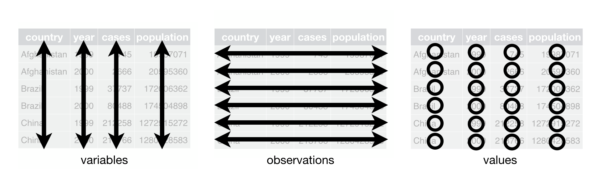
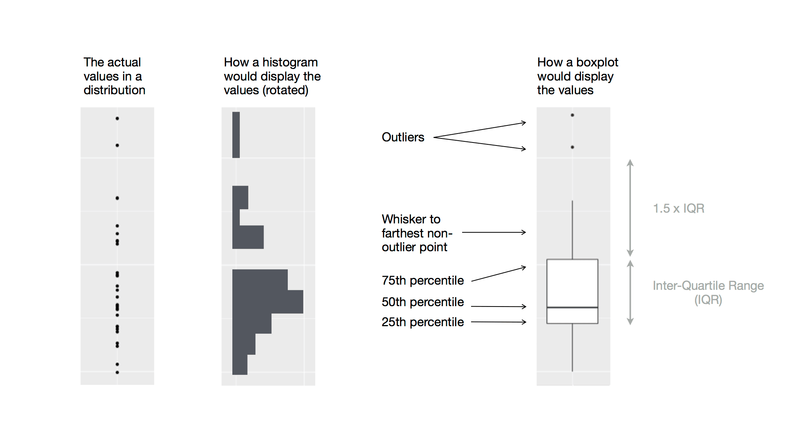

```{r setup, include=FALSE}
library(learnr)
library(tutorial.helpers)
library(tidyverse)
library(knitr)
library(palmerpenguins)
library(ggthemes) 
options(repos = c(CRAN = "https://cran.rstudio.com"))
if (!requireNamespace("gradethis", quietly = TRUE)) {
  learnr::tutorial_warning(
    "This tutorial uses the **gradethis** package to provide feedback.  
    It looks like you don’t have gradethis installed yet.  
    Please run this in your console:
    
    remotes::install_github('rstudio-education/gradethis')"
  )
} else {
  library(gradethis)
  gradethis::gradethis_setup()  # optional: standardizes grading defaults
}

knitr::opts_chunk$set(echo = FALSE)
knitr::opts_chunk$set(out.width = '90%')
options(tutorial.exercise.timelimit = 60, 
        tutorial.storage = "local") 
```

```{r info-section, child=system.file("child_documents/info_section.Rmd", package = "tutorial.helpers"),echo=F}
```

```{r copy-code-chunk, child=system.file("child_documents/copy_button.Rmd", package = "tutorial.helpers")}
```

## Acknowledgements

This tutorial draws from [Chapter 1: Data visualization](https://r4ds.hadley.nz/data-visualize.html) from [*R for Data Science (2e)*](https://r4ds.hadley.nz/). 
Original source code was written by David Kane in the `r4ds.tutorials` package.

Source code and content edited by Justin Luningham. For teaching purposes only.

## Introduction to `ggplot2`

R has several systems for making graphs, but [**ggplot2**](https://ggplot2.tidyverse.org/index.html) is one of the most elegant and most versatile. **ggplot2** implements the *grammar of graphics*, a coherent system for describing and building graphs. We will start with the following: 

- simple scatterplot example, adding features as we go
- plots for distributions of variables 
- saving figures

###

### Load packages

`ggplot2` is part of the `tidyverse`, and other included packages can help to set up our data for plotting. 

Load the [**tidyverse**](https://tidyverse.tidyverse.org/) library using `library()`.

```{r first-steps-1, exercise = TRUE}

```

```{r first-steps-1-hint-1, eval = FALSE}
library(...)
```

```{r first-steps-1-test, include = FALSE}
library(tidyverse)
```

### 

We will also use two other packages: the `palmerpenguins` package and the `ggthemes` package. Load these libraries below.

```{r first-steps-2, exercise = TRUE}

```

```{r first-steps-2-hint-1, eval = FALSE}
# do you need to install the packages first?
library(...)
```

```{r first-steps-2-test, include = FALSE}
library(palmerpenguins)
library(ggthemes)
```

### 

If you receive an error, don't forget that packages must be installed one time first before called into the library. 

### Data Questions

Do penguins with longer flippers weigh more or less than penguins with shorter flippers? 

What does the relationship between flipper length and body mass look like? Is it positive? Negative? Linear? Nonlinear? 

Does the relationship vary by the species of the penguin? How about by the island where the penguin lives?

### 

We can answer these questions **descriptively** by visualizing the dataset called `penguins`. The data include size measurements, clutch observations, and blood isotope ratios for adult foraging penguins observed on islands in the Palmer Archipelago near Palmer Station, Antarctica.


### Tabular data, revisited

**Tabular data** is data organized in a table. A table is a group of cells, organized in rows and columns. Tabular data is considered *tidy* if and only if it satisfies the following rules:

1.  Each variable is a column; each column is a variable.
2.  Each observation is a row, each row is an observation.
3.  Each value is a cell, each cell is a single value.

```{r}

```

Here, a variable refers to an attribute of the penguins, an observation is the measured attributes of a single penguin, and one penguin's measurement on `bill_length` is a cell/value. 

### View data

Examine the data in `penguins`.

```{r first-steps-5, exercise = TRUE}

```

```{r first-steps-5-hint-1, eval = FALSE}
penguins
glimpse(penguins)
```

```{r first-steps-5-test, include = FALSE}
penguins
```

Use the space below to make notes about the dataset. How many variables and observations? Is `penguins` stored as a data frame or tibble? And what's the difference again?

```{r first-steps-3}
question_text(NULL,
	answer(NULL, correct = TRUE),
	allow_retry = TRUE,
	try_again_button = "Edit Answer",
	incorrect = NULL,
	rows = 3)
```

### 

Our first view of the data will examine three variables:

-   `species`: a penguin’s species (Adelie, Chinstrap, or Gentoo).

-   `flipper_length_mm`: length of a penguin’s flipper, in millimeters.

-   `body_mass_g`: body mass of a penguin, in grams.


###

By the end of the first part of the tutorial, you will create a plot that looks like this:

```{r}
intro_p <- penguins |>
  drop_na() |> 
  ggplot(mapping = aes(x = flipper_length_mm, 
                       y = body_mass_g)) +
    geom_point(mapping = aes(color = species, 
                             shape = species)) +
    geom_smooth(method = "lm", formula = y ~ x) +
    labs(title = "Body Mass and Flipper Length",
         subtitle = "Dimensions for Adelie, Chinstrap, and Gentoo Penguins",
         x = "Flipper Length (mm)", 
         y = "Body Mass (g)",
         color = "Species", 
         shape = "Species") +
  scale_color_colorblind()

intro_p
```

## Building a `ggplot`
###

The idea behind `ggplot2` is to build plots starting with a blank canvas and adding layers of data and information. The first function for a plot is simply `ggplot()`, which stores the data and creates this blank canvas. 

Run the function `ggplot()` with the argument `data` equals our dataset, `penguins`. 

```{r first-steps-7, exercise = TRUE}

```

```{r first-steps-7-hint-1, eval = FALSE}
ggplot(...)
```

```{r first-steps-7-test, include = FALSE}
ggplot(data = penguins)
```

###

It's not an error to see a blank square - this is our blank canvas. It is a placeholder for a plot that accesses the data within `penguins`.

### aesthetic mapping

The "grammar of graphics" is intended to make plot building more intuitive. To tell `ggplot` how specific information from the data will be presented, we provide a `mapping` of the visual aesthetics of the plot. 

The `mapping` argument receives the `aes()` function. `aes` includes things like which variables go on the `x` and `y` axes. 

###

Complete the following code by placing `flipper_length_mm` on the x-axis and `body_mass_g` on the y-axis. 

```{r first-steps-9, exercise = TRUE}
ggplot(
  data = ...,
  mapping = aes(x = ..., ... = ...)
)
```


```{r first-steps-9-hint-1, eval = FALSE}
ggplot(
  data = penguins,
  mapping = aes(x = flipper_length_mm, y = ...)
)
```

```{r first-steps-9-test, include = FALSE}
ggplot(
  data = penguins,
  mapping = aes(x = flipper_length_mm, y = body_mass_g)
)
```

### Geometric layers

We've identified where some of the data should go, but not yet how it will be displayed. `ggplot` calls these displays **geometric objects**, or `geom`. There are many defined `geom`s that are usually intuitive based on the type of visualization we aim for in a plot: 

- `geom_bar()`
- `geom_line()`
- `geom_boxplot()`
- etc. 

To add a layer to the `ggplot`, we use `+` (again, mostly intuitive!). 

### 

We have two continuous variables on the x and y axes so far. We might chose to represent the data as a scatterplot. The geometric object to display these data is a single point per observation. `ggplot` calls this `geom_point()`. Let's add this below (you can use the button to copy the previous code):

```{r first-steps-10, exercise = TRUE}

```

<button onclick="transfer_code(this)">Copy previous code</button>

```{r first-steps-10-hint-1, eval = FALSE}
ggplot(
  data = penguins,
  mapping = aes(x = flipper_length_mm, y = body_mass_g)
) ...
  geom_point()
```

```{r first-steps-10-test, include = FALSE}
ggplot(
  data = penguins,
  mapping = aes(x = flipper_length_mm, y = body_mass_g)
) +
  geom_point()
```

###

Now we have something to do look at! How would we describe this relationship? 

### 

Note on warning message: two penguins have missing data on body mass and/or flipper length, and we can't represent them graphically without both values. `ggplot` does not allow data to silently go missing - it's something we need be aware of. Missing data is a huge part of quantitative research and data science. 

### Adding more aesthetics and layers 

Scatterplots can display the relationship between two numeric variables, but could there be more going on here? i.e., can a third variable explain or change the relationship? We already mentioned a third variable that may be important above.

###

Does this relationship differ by species? Since `species` is a grouping variable, we can change the appearance of our scatterplot by adding a color to represent each species. 

Is color-coding based on a specific **value** of a **variable** in the dataset a geometric feature, or an aesthetic feature? 

```{r first-steps-11}
question_text(NULL,
	answer(NULL, correct = TRUE),
	allow_retry = TRUE,
	try_again_button = "Edit Answer",
	incorrect = NULL,
	rows = 3)
```

###

We are preserving the geometric representation of the data (scatter), but we want map a variable to a visual feature. This is an aesthetic. 

Assigning colors to change based on a variable is accomplished by adding the argument `color = [variable_name]` within the `aes()` function of the `mapping` argument.

```{r first-steps-12, exercise = TRUE}
ggplot(
  data = penguins,
  mapping = aes(x = flipper_length_mm, y = body_mass_g, ...)
) +
  geom_point()
```

###

`ggplot` automatically recognizes that `species` is a categorical variable and assigns a unique color to each level of the variable. If you examine the data with `glimpse()`, you'll see it's coded as a factor (`<fct>`). 

### More layers

We have inferred a positive linear relationship among the scattered points, by why not represent this in a more straightforward way? 

Let's add another layer which plots a smooth line capturing the trend in the relationship between body mass and flipper length. In fact, we'll specify that this trend be the *linear association* between the variables. 

Do you think that adding a line to the plot is an aesthetic feature or a geometric feature? 

###

Plotting a smooth line based on information from multiple variables is a geometric object, not simply an aesthetic change.

To add another geometric feature, we can use `+` and specify a second `geom_`. A smoothed line geom is called `geom_smooth()`. It has many different options for the **method** that calculates this smooth line, which we can modify by providing an argument to the function. 

Below, copy our prior plot code and add a `geom_smooth` layer with `method = "lm"` as an argument. 

```{r first-steps-13, exercise = TRUE}

```

<button onclick="transfer_code(this)">Copy previous code</button>

```{r first-steps-13-hint-1, eval = FALSE}
ggplot(
  data = penguins,
  mapping = aes(x = flipper_length_mm, y = body_mass_g, color = species)
) +
  geom_point() +
  ...?
```

###

Here, we've added the lines, but we see the linear relationship *per species*, rather than the overall trend between body mass and flipper length. 

If we provide `aes()` mappings in the initial `ggplot()` function, these mappings are passed to all subsequent layers. 

However, each `geom` also accepts a mapping argument, such that we can change the aesthetic features at individual layers. 

### Altering layers

To plot species-specific colors but one overall line, how might we change the code from above to move around the `aes` mapping? 

```{r first-steps-14, exercise = TRUE}
ggplot(
  data = penguins,
  mapping = aes(x = flipper_length_mm, y = body_mass_g, color = species)
) +
  geom_point() +
  geom_smooth(method = "lm")
```

```{r first-steps-14-test, include = FALSE}
ggplot(
  data = penguins,
  mapping = aes(x = flipper_length_mm, y = body_mass_g)
) +
  geom_point(mapping = aes(color = species)) +
  geom_smooth(method = "lm")
```

### Multiple aesthetics/user friendly plots

Color plays an important role in our plot - it represents the different species - but relying on color alone as a communicator is unreliable. However, it is possible to map one variable to multiple aesthetic features. 

Copy the prior code mapping species to a `color` aesthetic and also map it to a `shape` aesthetic. 

```{r first-steps-15, exercise = TRUE}

```

<button onclick="transfer_code(this)">Copy previous code</button>

```{r first-steps-15-hint-1, eval = FALSE}
ggplot(
  data = penguins,
  mapping = aes(x = flipper_length_mm, y = body_mass_g)
) +
  geom_point(mapping = aes(color = species, shape = ...)) +
  geom_smooth(method = "lm")
```

###

Notice that the legend automatically combines both shape and color for one species, rather than providing two legends for shape and color separately. 

### Publication-ready plots 

The above plot is great for our own data exploration, but if we want to use it as a true communication tool in a publication, presentation, poster, or other written report, we can take additional steps to improve how information is conveyed. Particularly, we can improve the labels and add a title to the plot. 

`ggplot` allows us to add/modify labels in a distinct layer of the plot called `labs()`. Within `labs`, we can modify the text or appearance of many different features, but some of the most common are

- `title`
- `subtitle`
- `x`
- `y`
- legend labels for any aesthetics 


### 

There are numerous other ways to customize the appearance of plots and figures. For example, there are several built-in color schemes, or we can create our own. The `ggthemes` package provides a color scheme that is readable for individuals with color blindness. 

This can be added as a final layer called `scale_color_colorblind()`. 

Let's complete the final code for the plot together. 

###

```{r first-steps-16, exercise = TRUE}
ggplot(
  data = penguins,
  mapping = aes(x = flipper_length_mm, y = body_mass_g)
) +
  geom_point(aes(color = species, shape = species)) +
  geom_smooth(method = "lm") +
  labs(
    ... = "Body mass and flipper length",
    ... = "Dimensions for Adelie, Chinstrap, and Gentoo Penguins",
    ... = "Flipper length (mm)", ... = "Body mass (g)",
    ... = "Species", ... = "Species"
  ) +
  scale_color_...()
```

###

Note that we provided the same label for both `color` and `shape`. These labels were automatically combined before - is this really necessary? Let's experiment: 

```{r first-steps-17, exercise = TRUE}
ggplot(
  data = penguins,
  mapping = aes(x = flipper_length_mm, y = body_mass_g)
) +
  geom_point(aes(color = species, shape = species)) +
  geom_smooth(method = "lm") +
  labs(
    title = "Body mass and flipper length",
    subtitle = "Dimensions for Adelie, Chinstrap, and Gentoo Penguins",
    x = "Flipper length (mm)", y = "Body mass (g)",
    color = "Species", shape = "Species"
  ) +
  scale_color_colorblind()
```

###

The default label is the original variable name. If the two legends have different labels, they will appear separately on the plot. The legend is only combined when the labels match perfectly.

### Part 1 summary 

We've built our first plot in a step-by-step fashion to illustrate the logic behind `ggplot` - adding layers and "mapping" variables to specific features of the plot. This is the same process we'll follow for other types of `geom_`s and more complex figures. 

## Simplify `ggplot` calls 

### 

As we move on from these introductory sections, we’ll transition to a more concise expression of **ggplot2** code.

### Exercise 1

Run this code:

````
ggplot(
  data = penguins,
  mapping = aes(x = flipper_length_mm, y = body_mass_g)
) +
  geom_point()
````

```{r ggplot2-calls-1, exercise = TRUE}

```

```{r ggplot2-calls-1-test, include = FALSE}
ggplot(
  data = penguins,
  mapping = aes(x = flipper_length_mm, y = body_mass_g)
) +
  geom_point()
```

### 

Typically, the first one or two arguments to a function are so important that you should know them by heart. The first two arguments to `ggplot()` are data and mapping, in the remainder of the book, we won’t supply those names. 

### Exercise 2

Run this code:

````
ggplot(penguins, aes(x = flipper_length_mm, y = body_mass_g)) + 
  geom_point()
````

```{r ggplot2-calls-2, exercise = TRUE}

```

```{r ggplot2-calls-2-test, include = FALSE}
ggplot(penguins, aes(x = flipper_length_mm, y = body_mass_g)) + 
  geom_point()
```

### 

Leaving out the `data` and `mapping` arguments saves typing, and, by reducing the amount of extra text, makes it easier to see what’s different between plots. 

## Visualizing distributions
### 

How you visualize the distribution of a variable depends on the type of variable: categorical or numerical.

### One categorical variable

A variable is categorical if it can only take one of a small set of discrete values. To examine the distribution of a categorical variable, you can use a bar chart. 

The function to add a bar layer is `geom_bar()`. Below, create a `ggplot` to view the counts of penguins per species in our data.

```{r visualizating-distributions-1, exercise = TRUE}
ggplot(
  <data>, aes(< >) 
) +
  geom_...
```

```{r visualizating-distributions-1-hint-1, include = FALSE}
ggplot(penguins, aes(x = ...)) +
  geom_bar()
```

###

The height of the bars depict the number of observations per each `x` value.

###

For many single-variable plots like barcharts, we can actually interchange the `x` and `y` axes: 
```{r visualizating-distributions-extra, exercise = TRUE}
ggplot(
  penguins, aes(y = species)
  ) +
  geom_bar()
```

### Reordering categories

In bar plots of categorical variables with non-ordered levels, like the penguin species above, it’s often preferable to reorder the bars based on their frequencies. Doing so requires transforming the variable to a factor (how R handles categorical data) and then reordering the levels of that factor.

Replace `species` in the previous exercise with `fct_infreq(species)`.

```{r visualizating-distributions-2, exercise = TRUE}

```

<button onclick = "transfer_code(this)">Copy previous code</button>


```{r visualizating-distributions-2-hint, include = FALSE}
ggplot(penguins, aes(x = fct_infreq(species))) +
  geom_bar()
```

`fct_infreq` comes from the `forcats` package in the `tidyverse`. It helps manage and manipulate categorical variables. 

### One numeric variable

A variable is numerical (or quantitative) if it can take on a wide range of numerical values, and it is sensible to add, subtract, or take averages with those values. Numerical variables can be continuous or discrete. One commonly used visualization for distributions of continuous variables is a histogram. 

The geom for a histogram is `geom_histogram()`. Create a `ggplot` that depicts a histogram of `body_mass_g` from our `penguins` data. 

```{r visualizating-distributions-3, exercise = TRUE}

```

```{r visualizating-distributions-3-test, include = FALSE}
ggplot(penguins, aes(x = body_mass_g)) +
  geom_histogram()
```

###

Histograms divide a quantitative variable into equally spaced "bins", or discrete intervals. The height of the histogram presents the number of observations in a specific interval. 

The size of the intervals can change the appearance of a histogram. We can manually change the interval width with the `binwidth = ` argument in the `geom_histogram()` function.

Below, copy and paste the histogram code three times, and for each `geom_histogram()` call, add `binwidth = 20`, `binwidth = 200`, `binwidth = 2000`.

```{r visualizating-distributions-4, exercise = TRUE}

```

<button onclick = "transfer_code(this)">Copy previous code</button>

###

A binwidth of 20 is too narrow, resulting in too many bars, making it difficult to determine the shape of the distribution. A `binwidth` of 2,000 is too high, resulting in all data being binned into only three bars, and also making it difficult to determine the shape of the distribution. A `binwidth` of 200 provides a sensible balance.

###

An alternative visualization for distributions of numerical variables is a density plot. A density plot is a smoothed-out version of a histogram and a practical alternative, particularly for continuous data that comes from an underlying smooth distribution. Replace `geom_histogram(binwidth = 2000)` in the previous exercise with `geom_density()`.


```{r visualizating-distributions-6, exercise = TRUE}

```

<button onclick = "transfer_code(this)">Copy previous code</button>

```{r visualizating-distributions-6-hint-1, eval = FALSE}
ggplot(penguins, aes(x = body_mass_g)) +
  ..._density()
```

```{r visualizating-distributions-6-test, include = FALSE}
ggplot(penguins, aes(x = body_mass_g)) +
  geom_density()
```

### 

We won’t go into how `geom_density()` estimates the density (you can read more about that in the function documentation), but let’s explain how the density curve is drawn with an analogy. Imagine a histogram made out of wooden blocks. Then, imagine that you drop a cooked spaghetti string over it. The shape the spaghetti takes draped over blocks is the shape of the density curve. It shows fewer details than a histogram but can make it easier to quickly glean the shape of the distribution, particularly with respect to modes and skewness.

## Visualizating relationships
### 

To visualize a relationship we need to have at least two variables mapped to aesthetics of a plot. 

### Boxplots 

To visualize the relation
ship between a numerical and a categorical variable we can use side-by-side box plots. A boxplot is a type of visual shorthand for measures of position (percentiles) that describe a distribution. It is also useful for identifying potential outliers. 

### 

A boxplot consists of:

* A box that indicates the range of the middle half of the data

* A line in the middle of the box is a line that displays the median

* Visual points that display observations that fall more than 1.5 times the IQR from either edge of the box

* A line (or whisker) that extends from each end of the box and goes to the farthest non-outlier point in the distribution

```{r echo = FALSE}

```

###

Examine the distribution of body mass by species using 

- species along `x` axis
- body mass on `y` axis
- the geom is `geom_boxplot()`

```{r visualizating-relationships-3, exercise = TRUE}

```

```{r visualizating-relationships-3-hint-1, eval = FALSE}
ggplot(penguins, aes(x = species, y = body_mass_g)) +
  ...()
```

```{r visualizating-relationships-3-test, include = FALSE}
ggplot(penguins, aes(x = species, y = body_mass_g)) +
  geom_boxplot()
```

### 

Another way to look at this data is with `geom_density()`. Run this code:

````
ggplot(penguins, aes(x = body_mass_g, color = species)) +
  geom_density(linewidth = 0.75)
````

```{r visualizating-relationships-4, exercise = TRUE}

```

```{r visualizating-relationships-4-hint-1, include = FALSE}
ggplot(penguins, aes(x = body_mass_g, color = species)) +
  geom_density(...)
```

###

We can map species to both `color` and `fill` aesthetics to differentiate the species-specific distributions. We need to use the `alpha` aesthetic to add transparency to the `fill` of the density curves. 

`alpha` takes values between 0 (completely transparent) and 1 (completely opaque). In the following plot it’s set `to`alpha = 0.5` within `geom_density()`. 

```{r visualizating-relationships-5, exercise = TRUE}
ggplot(penguins, aes(x = body_mass_g, color = species, fill = ...)) +
  geom_density(...)
```

```{r visualizating-relationships-5-test, include = FALSE}
ggplot(penguins, aes(x = body_mass_g, color = species, fill = species)) +
  geom_density(alpha = 0.5)
```

### 

Note the terminology we have used here:

* We *map* variables to aesthetics if we want the visual attribute to vary **based on the values of that variable**.

* Otherwise, we *set* the value of an aesthetic.

###

We can use stacked bar plots to visualize the relationship between two categorical variables. Run this code:

````
ggplot(penguins, aes(x = island, fill = species)) +
  geom_bar()
````

```{r visualizating-relationships-6, exercise = TRUE}

```

```{r visualizating-relationships-6-test, include = FALSE}
ggplot(penguins, aes(x = island, fill = species)) +
  geom_bar()
```

### 

This plot shows the frequencies of each species of penguins on each island. The plot of frequencies shows that there are equal numbers of Adelies on each island. But we don’t have a good sense of the percentage balance within each island.

### 

Change the code by adding `position = "fill"` as an argument to `geom_bar()`. In creating these bar charts, we map the variable that will be separated into bars to the x aesthetic, and the variable that will change the colors inside the bars to the fill aesthetic.


```{r visualizating-relationships-7, exercise = TRUE}

```

<button onclick = "transfer_code(this)">Copy previous code</button>

```{r visualizating-relationships-7-hint-1, eval = FALSE}
ggplot(penguins, aes(x = island, fill = species)) +
  geom_bar(... = "fill")
```

```{r visualizating-relationships-7-test, include = FALSE}
ggplot(penguins, aes(x = island, fill = species)) +
  geom_bar(position = "fill")
```

### 

Using this plot we can see that Gentoo penguins all live on Biscoe island and make up roughly 75% of the penguins on that island, Chinstrap all live on Dream island and make up roughly 50% of the penguins on that island, and Adelie live on all three islands and make up all of the penguins on Torgersen.


### Scatterplots, revisited

So far you’ve learned about scatterplots (created with `geom_point()`) and smooth curves (created with `geom_smooth()`) for visualizing the relationship between two numerical variables. Run this code:

````
ggplot(penguins, aes(x = flipper_length_mm, y = body_mass_g)) +
  geom_point()
````

```{r visualizating-relationships-8, exercise = TRUE}

```

```{r visualizating-relationships-8-test, include = FALSE}
ggplot(penguins, aes(x = flipper_length_mm, y = body_mass_g)) +
  geom_point()
```


A scatterplot is probably the most commonly used plot for visualizing the relationship between two numerical variables.


### 

We can incorporate more variables into a plot by mapping them to additional aesthetics. For example, in the following scatterplot the colors of points represent species and the shapes of points represent islands. Copy the code from above, but add `color = species, shape = island` to an `aes` mapping in `geom_point`.


```{r visualizating-relationships-9, exercise = TRUE}

```

```{r visualizating-relationships-9-hint-1, include = FALSE}
ggplot(penguins, aes(x = flipper_length_mm, y = body_mass_g)) +
  geom_point(aes(color = species, shape = island))
```

### 

Adding too many aesthetic mappings to a plot makes it cluttered and difficult to make sense of. Another way, which is particularly useful for categorical variables, is to split your plot into **facets**, subplots that each display one subset of the data.

### Exercise 10

To facet your plot by a single variable, use `facet_wrap()`.  Run this code:

````
ggplot(penguins, aes(x = flipper_length_mm, y = body_mass_g)) +
  geom_point(aes(color = species, shape = species)) +
  facet_wrap(~island)
````

```{r visualizating-relationships-10, exercise = TRUE}

```

```{r visualizating-relationships-10-test, include = FALSE}
ggplot(penguins, aes(x = flipper_length_mm, y = body_mass_g)) +
  geom_point(aes(color = species, shape = species)) +
  facet_wrap(~island)
```

### 

The first argument of `facet_wrap()` is a formula, which you create with `~` followed by a variable name. The variable that you pass to `facet_wrap()` should be categorical.

## Saving your plots
### 

Once you’ve made a plot, you might want to get it out of R by saving it as an image that you can use elsewhere. That’s the job of [`ggsave()`](https://ggplot2.tidyverse.org/reference/ggsave.html), which will save the plot most recently created to disk.

### Exercise 1

Recreate our first scatterplot with this code:

````
ggplot(penguins, aes(x = flipper_length_mm, 
                     y = body_mass_g)) +
  geom_point()
````  


```{r saving-your-plots-1, exercise = TRUE}

```

```{r saving-your-plots-1-hint-1, eval = FALSE}
ggplot(penguins, aes(x = flipper_length_mm, 
                     y = body_mass_g)) +
  geom_point()
```

```{r saving-your-plots-1-test, include = FALSE}
ggplot(penguins, aes(x = flipper_length_mm, 
                     y = body_mass_g)) +
  geom_point()
```

### Exercise 2

In order to save a copy of this plot, we use the `ggsave()` by running `ggsave(filename = "penguin-plot.png")` immediately after creating the plot.


```{r saving-your-plots-2, exercise = TRUE}
ggplot(penguins, aes(x = flipper_length_mm, 
                     y = body_mass_g)) +
  geom_point()


```


```{r saving-your-plots-2-hint-1, eval = FALSE}
ggplot(penguins, aes(x = flipper_length_mm, 
                     y = body_mass_g)) +
  geom_point()

ggsave(... = "penguin-plot.png")
```

```{r saving-your-plots-2-test, include = FALSE}
ggplot(penguins, aes(x = flipper_length_mm, 
                     y = body_mass_g)) +
  geom_point()

ggsave(filename = "penguin-plot.png")

file.remove("penguin-plot.png")
```

### 

By default, `ggsave()` saves the most recently created plot.

If you don’t specify the width and height, they will be taken from the dimensions of the current plotting device. For reproducible code, you’ll want to specify them. 

### Exercise 3

Run this code:

````
my_plot <- ggplot(penguins, aes(x = flipper_length_mm, 
                     y = body_mass_g)) +
  geom_point()

my_plot
````  


```{r saving-your-plots-3, exercise = TRUE}

```

```{r saving-your-plots-3-hint-1, eval = FALSE}
my_plot <- ...(penguins, aes(x = flipper_length_mm, 
                     y = body_mass_g)) +
  geom_point()

...
```

```{r saving-your-plots-3-test, include = FALSE}
my_plot <- ggplot(penguins, aes(x = flipper_length_mm, 
                     y = body_mass_g)) +
  geom_point()

my_plot
```

### 

When creating plots to save, it is best practice to explicitly create an object. Don't count on the fact that `ggsave()` saves the last plot you created. What happens when you move the plotting code to another location? Instead, make it certain which object you are saving. 

### Exercise 4

Use the code from the last exercise, but replace `my_plot` with `ggsave(filename = "penguin-plot.png", plot = my_plot)`.

```{r saving-your-plots-4, exercise = TRUE}

```

<button onclick = "transfer_code(this)">Copy previous code</button>

```{r saving-your-plots-4-hint-1, eval = FALSE}
my_plot <- ggplot(penguins, aes(x = flipper_length_mm, 
                     y = body_mass_g)) +
  geom_point()

ggsave(... = "penguin-plot.png", plot = ...)
```

```{r saving-your-plots-4-test, include = FALSE}
my_plot <- ggplot(penguins, aes(x = flipper_length_mm, 
                     y = body_mass_g)) +
  geom_point()

ggsave(filename = "penguin-plot.png", plot = my_plot)

file.remove("penguin-plot.png")
```

### General coding note

`R` is extremely picky, and a misplaced character can make all the difference. Make sure that every `(` is matched with a `)` and every `"` is paired with another `"`. Sometimes you’ll run the code and nothing happens. Check the left-hand of your console: if it’s a `+`, it means that `R` doesn’t think you’ve typed a complete expression and it’s waiting for you to finish it. In this case, it’s usually easy to start from scratch again by pressing ESCAPE to abort processing the current command.

### Exercise 5

One common problem when creating **ggplot2** graphics is to put the `+` in the wrong place: it has to come at the end of the line, not the start. For example, run this code:

````
ggplot(data = mpg) 
+ geom_point(mapping = aes(x = displ, y = hwy))
````

```{r saving-your-plots-5, exercise = TRUE}

```

### 

Note how the error message explains the problem.

If you get stuck when coding, the first course of action is to try the help page. As we learned last week, you can get help with almost any `R` function by running `?function_name` in the Console, or highlighting the function name and pressing F1 in RStudio. 


```{r download-answers, child=system.file("child_documents/download_answers.Rmd", package = "tutorial.helpers"),echo=F}
```

