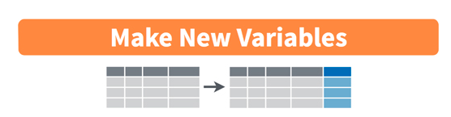

```{r setup, include=FALSE}
library(learnr)
library(tutorial.helpers)
library(tidyverse)
library(knitr)
library(nycflights23)
options(repos = c(CRAN = "https://cran.rstudio.com"))
if (!requireNamespace("gradethis", quietly = TRUE)) {
  learnr::tutorial_warning(
    "This tutorial uses the **gradethis** package to provide feedback.  
    It looks like you don’t have gradethis installed yet.  
    Please run this in your console:
    
    remotes::install_github('rstudio-education/gradethis')"
  )
} else {
  library(gradethis)
  gradethis::gradethis_setup()  # optional: standardizes grading defaults
}

knitr::opts_chunk$set(echo = FALSE)
knitr::opts_chunk$set(out.width = '90%')
options(tutorial.exercise.timelimit = 60, 
        tutorial.storage = "local") 
```

```{r info-section, child=system.file("child_documents/info_section.Rmd", package = "tutorial.helpers"),echo=F}
```


```{r copy-code-chunk, child=system.file("child_documents/copy_button.Rmd", package = "tutorial.helpers")}
```


## Acknowledgement

This content follows and adapts chapter 3 of Statistical Inference via Data Science by Ismay, Kim, \& Valdivia (2025). Built by Justin Luningham using the `learnr` and `tutorial.helpers` packages. 

## Data Wrangling with `dplyr`
###

This tutorial introduces some key functions from the `dplyr` package for data "wrangling" (i.w., data management, organization, transformation, etc.). `dplyr` is part of the `tidyverse`. It has a very thorough development history with detailed documentation, online tutorials, RStudio Cheat Sheets, etc. 

```{r out.width="225px"}
url <- "https://dplyr.tidyverse.org/logo.png"
knitr::include_graphics(url)
```

###

Based on similar logic as `ggplot` for a grammar of graphics, `dplyr` is billed as a grammar of data manipulation. It includes a set of key "verbs" as functions to perform the most common data manipulation tasks: 

1. `filter()` the dataset to contain certain rows that meet a condition.
2. `select()` specific columns or variables from the dataset.
3. `summarize()` one or more columns of the data with a summary statistic.
4. `mutate()` existing columns/variables to create new ones. 
5. `group_by()` specific conditions of a variable. For example, `group` rows of Palmer penguins `by` their value on the `species` variable.
6. `arrange()` the rows, e.g., by sorting rows in ascending or descending order on a variable. 
7. `join()` a dataset with another dataset, matching on certain variables (like subject ID).
8. `slice()` the dataset by extracting specific rows. 

###

There are even more verbs and helper functions, but these are the ones we will cover over the next week. 

Another key feature of `dplyr` is the use of the pipe operator. The pipe operator was first introduced as part of the `tidyverse`, but it is now built into base `R` (called "native pipe"). The pipe operator looks like ` |>` . It can be inserted with `Ctrl + Shift + M`. 

If you have learned to use the pipe before, you may have seen it as `%>%`. This is the `tidyverse` pipe. The native pipe `|>` is now preferred because its use does not depend on loading specific libraries. However, in practice, either can work. 

### Using the pipe

The beauty of the pipe is that it combines multiple operations into a logical, sequential *chain* of actions. The pipe is similar to `+` in `ggplot`: we provide something like a dataset, apply a pipe which translates to "then do", add a function, "then do" another function, etc. 

In an abstract sense, say we had an object `x`, and we wanted to first perform the function `f()` on `x`. Then, we wanted to perform `g()` on the result of `f(x)`, and finally, we wanted to use the output of `g()` as an input to function `h()`. We could write a series of nested parentheses as follows: 

```
h(g(f(x)))
```

### 

While this example is not hard to read, it would be challenging if each function had its own arguments that needed to be modified. Further, there are more opportunities for errors, placing arguments to one function accidentally within the parentheses for another function. 

Instead, the pipe operator helps us to organize and keep track of each step in the sequence. The following is equivalent to above, but piped: 

```
x |>
  f() |>
  g() |>
  h()
```

###

"Take x, *then* use it as input for the next function `f(), *then* use the output as input for `g()`, *then* use that output as input for `h()`".

As another example, we can use the pipe to "pass" the `penguins` data to a `ggplot`. 

```{r, pipe_ex, exercise = T}
penguins |>
  ggplot(aes(x = flipper_length_mm, 
             y = body_mass_g)) +
    geom_point()
```

In the realm of data manipulation with `dplyr`, each verb does one thing really well, but to fully organize our data, we will often chain together many verbs in a sequence. Hence, the pipe is very useful.

## `filter` rows
###

`filter` retains rows that match a certain criteria. It is similar to using "Filter" in Excel, but with code. 

First, load the `nycflights23` package and `glimpse` the `flights` data frame. 

```{r, filter1, exercise = TRUE}
library(nycflights23)
...(flights)
```

###

Then, our first task is to subset the `flights` data to only those flights from NYC to Phoenix (airport code: `PHX`). 

```{r, filter2, exercise = TRUE}
flights [then]
  ...(destination is phoenix)
```

```{r, filter2-hint-1, eval = FALSE}
flights |>
  filter(dest == "PHX")
```

###

Notes: our first input is the original data, `flights`; *then* filter the rows by a specific condition (destination is Phoenix, or `dest == PHX`). Recall lessons of Boolean operators and equivalence tests from our first week. 

###

Next, filter flights for all rows were headed to Phoenix in 4th quarter of the calendar year (October, November, or December). 

Recall from our `glimpse` that `month` was an integer. Our target months are 10, 11, and 12. 

```{r, filter3, exercise = TRUE}
flights [then]
  filter(month ...)
```

```{r, filter3-hint-1, eval = FALSE}
flights |>
  filter(month >= ...)
```

###

There are many operators to use for `filter`ing (or `slice` or other purposes). 

- `>`, `<`
- `>=`, `<=` 
- `!=` (exclamation is used in many coding languages to indicate "not")

To combine multiple criteria:

- `|` corresponds to "or"
- `&` "and"

### 

If we want data from Oct - Dec, there are many equivalent paths:

```{r, echo = TRUE}
flights |>
  filter(month >= 10)
flights |>
  filter(month > 9)
flights |>
  filter(month == 10 | month == 11 | month == 12)
```

Best practice, though, is to use the most succinct and exact code to minimize errors. In this case, `>= 10`. 

###

Note that these are large data tables, so the default view is only of the first thousand rows. To know if we are performing different operations, we need to check the dimensions of the resulting table from `filter`. There are many ways to do this, but an efficient one is to pipe the result of `filter()` to `glimpse()`. 

```{r, echo = TRUE}
flights |>
  filter(month >= 10) |> glimpse()
flights |>
  filter(month > 9) |> glimpse()
```

###

This is great, but we are only performing a small amount of filtering on a large dataset. In real life, we may have much more exact filtering to do. Let's now use `filter` to subset all flights that:

- departed from JFK
- were headed to Burlington, VT ("`BTV`") or Seattle (`SEA`)
- departed in the 3rd quarter of the year 

```{r, filter4, exercise = TRUE}
flights [then]
  filter(origin =..., dest =..., month =...) |>
    glimpse()
```

```{r, filter4-hint-1, eval = FALSE}
flights |>
  filter(origin == "JFK" & (dest == "BTV" | ...) & month >=7 & month <=...) |>
    glimpse()
```

### 

One important note here: across the multiple "and" conditions, we placed the two "or" conditions within a parenthetical. 

`filter` is actually set up to accept multiple conditions without stringing together `&`. It can be replaced with commas. 

```{r, filter5, exercise = TRUE}
flights |>
  filter(origin == "JFK", (dest == "BTV" | dest == "SEA"), 
         month >=7, month <=9) |>
    glimpse()
```

###

Note that these are large data tables, so the default view is only of the first thousand rows. To know if we are performing different operations, we need to check the dimensions of the resulting table from `filter`. 

Placing the `!` operator before a conditional statement seeks the opposite of that conditional. Placing `!` before multiple conditions in a parenthetical looks for the opposite of both statements. Example: flights that did *not* go to Burlington or Seattle. 

```{r, filter6, exercise = TRUE}
flights [then]
  filter((dest = "BTV" | dest = "SEA")) |>
    glimpse()
```

```{r, filter6-hint-1, eval = FALSE}
flights |>
  filter(!(dest == "BTV" | dest == "SEA")) |>
    glimpse()
```

### 

Run the following. Is it equivalent to above? Why or why not? 

```{r, filter7, exercise = TRUE}
flights |>
  filter(dest != "BTV" | dest != "SEA") |>
    glimpse()
```

###

This extracts every row not equal to BTV (which includes SEA) OR every row not equal to SEA (which includes BTV). So every row is retained. 

How can we fix it to do what we want? 

```{r, filter8, exercise = TRUE}
flights |>
  filter(dest != "BTV" | dest != "SEA") |>
    glimpse()
```

### 

To select flights headed to one of multiple airports, we could use many "or" `|` conditions: 

```{r, filter9, exercise = TRUE}
flights |>
  filter(dest == "SEA" | dest == "SFO" | dest == "PHX" |
         dest == "BTV" | dest == "BDL") |>
    glimpse()
```

This gets messy (and tedious) quickly. 

###

Instead, we can use a different special operator `%in%`, along with `c()` (a vector of values). 

```{r, filter10, exercise = TRUE}
flights |>
  filter(dest %in% c("SEA", "SFO", "PHX", "BTV", "BDL"))
```

This filters to any destination that matches one of the values in the vector of airports.

### Assigning filtered data 

Note that the output of `data |> filter` prints out a full data table in the console. The result of `filter` does not overwrite your prior data, and it is not saved in your environment. Typically, we want to **do** something more with the filtered dataset. Instead, we need to assign the result to an object for future operations. 

```{r, filter11, exercise = TRUE}
flights_q4 <- flights |> filter(month >= 10)
glimpse(...)
```


## `select()`
###

For special operations or summaries, we may want to retain a subset of all the variables (columns) in a dataset. `select()` will do this for us easily: 


To view only the `flight` and `carrier` variables, we would pipe `flights` to `select` and write the names of those two variables: 

```{r, select1, exercise=TRUE}
flights |>
  select(carrier, flight) |> glimpse()
```

###

`select()` makes it convenient to "de-select" or drop certain variables. In the `flights` data frame, all flight info comes from 2023, so the column `year` is not really a variable - it doesn't vary at all in the whole dataset. If we want to drop it, we use the `-` sign. 

```{r, select2, exercise=TRUE}
flights |>
  select(-year) |> glimpse()
```

### 

`select` has some built-in helper functions that help select multiple columns in larger data. The helpers search for string matches across the variable names. These functions are `starts_with()`, `ends_with()`, and `contains()`. 

```{r, select3, exercise=TRUE}
... |>
  select(starts_with("a")) 

... |>
  select(ends_with("delay")) 

... |>
  select(contains("time")) 
```

###

Note that `select` does not require quotes around the full variable names themselves, but the helper functions do because they search for patterns in strings or characters. 

These functions are very helpful when we pull data from sources like Qualtrics or Redcap, when variable names exported by these programs sometimes have long and convoluted names. 

### 

`select` is also a convenient way to reorder variables when you have larger datasets. When you enter variables to be selected, they are returned in that order. 

View the variables again: 

```{r, select4, exercise = TRUE}
glimpse(flights)
```

Say we wanted to arrange hour, minute, and time_hour to follow directly after year, month, and day. However, we don't want to drop any variables. We can reorder the variables of interest then `select` the rest of the columns with another helper function: 

```{r, select5, exercise = TRUE}
flights |>
  select(year, month, day, hour, minute, time_hour, everything()) |>
  glimpse()
```


## `summarize()`

###
A critical step for understanding our data is to calculate summary statistics of important variables. `summarize()` is a convenient way to obtain summaries of our data. 

What are some common summary statistics you might calculate and report in your own research projects?

###

The `summarize` function takes the original data and performs specific calculations on different variables. We can easily use this function to create summary tables for research reports and manuscripts. 


(note that British English spelling `summarise()` also works). 

###

Let's summarize the `windspeed` recorded in the `weather` data frame. This is a quantitative variaable, so mean and standard deviation are useful summary stats. The form for summarize is: 
`data |> summarize(name_of_summary_column = summary_function(variable))`. 

```{r, echo = TRUE}
glimpse(weather)
```

```{r, summarize1, exercise=TRUE}
weather |> 
  summarize(mean_wind = mean(wind_speed), sd_wind = sd(wind_speed))
```

### 

Hm. This is clearly a problem. Recall, though, that the usual behavior across `R` functions is that missing data will not go unnoticed or disappear without warning. The default for the base functions `mean()` and `sd()` is to return `NA` if there are ANY missing observations in the calculation. The argument in the function is `na.rm`, and the default is `FALSE`. `na.rm = TRUE` will perform listwise deletion of all missing values before calculating the statistics. 

###

Try again with these new arguments below. Where should we place the arguments? 

```{r, summarize2, exercise=TRUE}
weather |> 
  summarize(mean_wind = mean(wind_speed), sd_wind = sd(wind_speed))
```

### 

`summarize` can use any summary function that takes many values of data and returns just one summary value. Some important examples are: 

- `mean()` and `sd()`
- `min()` and `max()`
- `median()` and `IQR()`
- `sum()`
- `n()`, a count of the number of rows in a group.

### 

We can also create our own summary calculations within summarize. E.g., calculating mean directly, and converting to meters per second:

```{r, summarize3, exercise=TRUE}
weather |> 
  summarize(mean_wind_mph = sum(wind_speed, na.rm=T)/sum(!is.na(wind_speed)),
            mean_wind_meters_p_second = mean_wind_mph * 0.44704)
```

## Mutate 
###


`mutate()` is function that uses existing variable to create a new variable. This can involve converting units, recoding categories, or discretizing a continuous variable into a categorical one.

`mutate()` is somewhat like `summarize()` in the sense that we may perform calculations within the funciton, but be assured they serve very different purposes. `summarize()` reduces many values to one summary value. `mutate()` adds new columns (or replaces current ones).



###

For example, we can create a new variable that presents `temp` in Celsius instead of Fahrenheit. After performing the `mutate`, glimpse the new `weather` dataframe and then select the columns `temp` and `temp_in_C`.

```{r, mutate1, exercise=TRUE}
weather <- weather |> 
  mutate(temp_in_C = (temp - 32)/1.8)


```
  
###

`temp_in_C` is a new variable that did not exist before, so it creates a new column in the dataset. If we had named it `temp`, it would have overwritten the existing `temp` in Fahrenheit.

###

Let's return to the`flights` data. Passengers are frustrated by delayed flight departures, but if the pilot can make up the time in the air, the frustration is reduced. This is referred to as *gain* in the airline industry. 

We have departure delays and arrivale delays in the data as `dep_delay` and `arr_delay`, respectively. Let's add a new variable that is the dfference between the two and call it `gain`. 

```{r, mutate2, exercise=TRUE}
flights <- ... |>
  ...(gain = ...)

```
  
  
```{r, mutate2-hint-1, eval=F}
flights <- flights |>
  mutate(gain = [dep - arr])
```
  
Now `select` and view the columns `dep_delay`, `arr_delay`, and `gain` to double-check our work. 

```{r, mutate3, exercise=TRUE, exercise.setup = "mutate2"}


```
  
### 

Our created variable is now accessible just like any other variable in the dataset. Let's obtain some summary statistics of our new `gain` variable, including `mean`, `median`, `sd`, `min`, and `max`. A very helpful summary is also the number of missing observations. This can be calculated with `sum(is.na(gain))`. Here, `is.na` returns a `TRUE` or `FALSE` for every observation if it's missing. Summing up these booleans gives a 1 for every `TRUE` and a 0 for every `FALSE`. 

```{r, mutate4, exercise=TRUE, exercise.setup = "mutate2"}


```

```{r, mutate4-hint-1, eval=F}
gain_summary <- flights |>
  ...(mean = ,
      median = ,
      sd = ,
      min = ,
      max = ,
      missing = sum(is.na(gain))
gain_summary
```

###

Another useful feature of `mutate` is that we can create new variables within the same code - even variables that depend on other *new* variables. For example: 

```{r, mutate5, exercise = TRUE}
flights |>
  mutate(
    gain = dep_delay - arr_delay,
    hours = air_time / 60,
    gain_per_hour = gain / hours
  ) |> glimpse()
```

## `group_by()`

###

`group_by()` is a function that will assign specific groupings to rows before performing other functions. For example, recall our previous summary of the mean and SD of wind speed:

```{r, group1, exercise = TRUE}
weather |>
  summarize(mean = mean(wind_speed, na.rm = TRUE),
            std_dev = sd(wind_speed, na.rm = TRUE))
```

Say that we wanted the mean and SD of windspeed splits for each month, rather than overall. We add a `group_by()` function to the pipe sequence *before* the `summarize` function. 

Copy and paste the code from above, but add `group_by(month)` in the pipeline before `summarize`. 

```{r, group2, exercise = TRUE}

```

<button onclick="transfer_code(this)">Copy previous code</button>

```{r, group2-hint-1, eval = FALSE}
weather |>
  group_by(...) |>
  summarize(mean = mean(wind_speed, na.rm = TRUE),
            std_dev = sd(wind_speed, na.rm = TRUE))
```

###

Note that `group_by()` doesn't actually change the dataframe on its own. Instead, it changes the meta-data of the data frame, so that subsequent functions can recognize a specific grouping structure and act accordingly.

###

Let's now revisit the `n()` counting function we briefly introduced previously. Recall that the `n()` function counts rows. This is opposed to the `sum()` summary function that returns the sum of a numerical variable. For example, suppose we'd like to count how many flights departed each of the three airports in New York City. 

First, pipe `flights` to `group_by()`, and the grouping variable is `origin`. Then pass that to the next function, `summarize()`, with an argument of `count = n()`. 

```{r, group3, exercise = TRUE}

```

<button onclick="transfer_code(this)">Copy previous code</button>

```{r, group3-hint-1, eval = FALSE}
flights |>
  group_by(origin) |>
  summarize(count = n())
```

### 

We can easily group by more than one variable to create cross tabulations of multiple categorical variables. Copy the code from the last chunk, but group by both airport and month with `origin, month` in the `group_by()` argument. 

```{r, group4, exercise = TRUE}

```

<button onclick="transfer_code(this)">Copy previous code</button>


```{r download-answers, child=system.file("child_documents/download_answers.Rmd", package = "tutorial.helpers"),echo=F}
```


