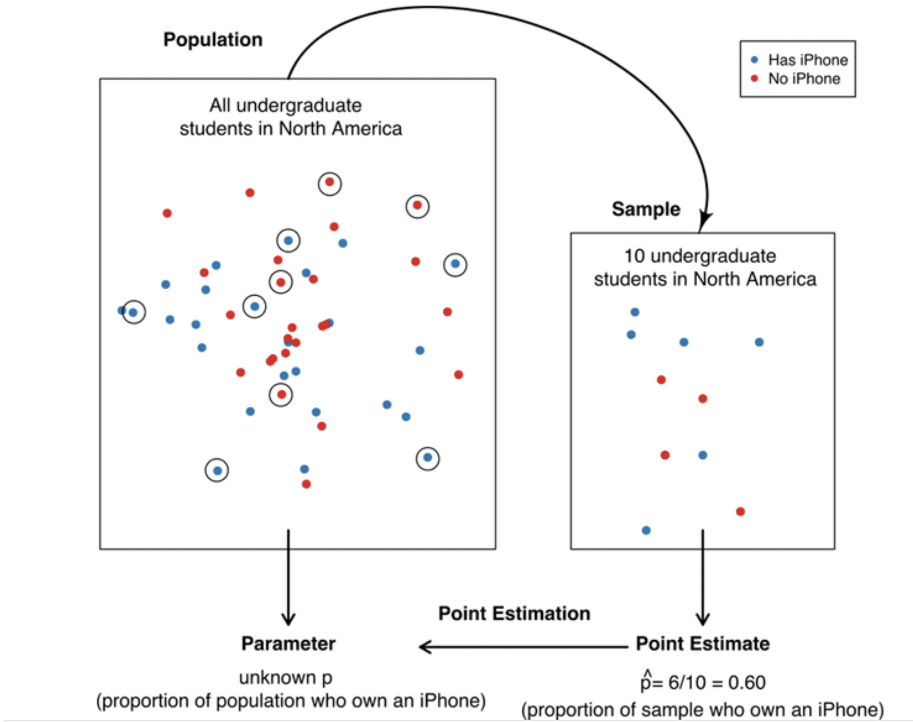

```{r setup, include=FALSE}
knitr::opts_chunk$set(echo = FALSE)
library(tidyverse)
library(infer)
library(moderndive)
library(learnr)
library(tutorial.helpers)
options(repos = c(CRAN = "https://cran.rstudio.com"))
if (!requireNamespace("gradethis", quietly = TRUE)) {
  learnr::tutorial_warning(
    "This tutorial uses the **gradethis** package to provide feedback.  
    It looks like you don’t have gradethis installed yet.  
    Please run this in your console:
    
    remotes::install_github('rstudio-education/gradethis')"
  )
} else {
  library(gradethis)
  gradethis::gradethis_setup()  # optional: standardizes grading defaults
}
```


```{r info-section, child = system.file("child_documents/info_section.Rmd", package = "tutorial.helpers")}
```


## Statistical Inference Refresher 

If you've taken any stats class before (even just your undergrad stats), you have had some kind of introduction to the concept of statistical inference. This week, we'll use `R` to introduce some fundamentals of statistical inference. Statistical inference forms the foundation for all of our common, traditional tests. 

## Population vs. Sample
###

The most essential principle of statistical inference is the need for sampling and the distinction between a sample and a population. 

###

When we conduct research, we are always interested in learning about some effect, process, or characteristic among the entire population that we are studying. Out of necessity, we can only actually observe a small subset of the population - it's impossible to observe the population in its entirety. 

###

As a simple example, say a major retailer that operates university bookstores is considering adding iPhone accessories to its shelves. To determine if this is worthwhile, they need to know the market size and share for their products. They want to know: *what proportion of all undergraduate students in North America own an iPhone?* 

###

In this question, we can identify some key terms: 

* the **population** here is all undergraduate students in North America
* we are interested in a specific quantity: the proportion of iPhone owners in the entire population. this is called a **population parameter**

Of course, we can't practically survey every single undergraduate in North America. Suppose we sampled 10 students at random and asked if they owned an iPhone.

* These 10 students are called a **sample**. 
* The **sample statistic** is the proportion of these 10 students who own an iPhone.

{width=80%}


In general, the process of using a sample to make a conclusion about the broader population from which it is taken is referred to as statistical inference.

## A simple, hands-on example 

Let's use the power of `R` to illustrate these concepts. In particular, we will conduct a simulation study to demonstrate three of the most important concepts in statistics: the **central limit theorem**, the **law of large numbers**, and **square root law**. 

### Bowl of red and white balls 

This example is adapted from *Statistical Inference via Data Science* by Ismay et al. (2025). To introduce inference, they brought a bowl containing red and white balls into their class.

{width=80%}

The balls have been thoroughly mixed together. Our task is to determine the proportion of red balls in bowl.

In this unique situation, we actually have data for the entire bowl. The data table is called `bowl` in `moderndive` package. 

```{r step1, exercise = T}
library(moderndive)

```

```{r quiz1, echo = FALSE}
question("All of the balls in the bowl are defined as...",
           answer("the sample"),
           answer("the population", correct = TRUE),
           answer("the population parameter"),
           answer("the sample statistic"),
           allow_retry = TRUE
  )
```
         
###

This is the entire population of red and white balls. In the `bowl` data, let's calculate the proportion of red balls. As usual, there are numerous ways to get to this solution:

```{r prop1, exercise = TRUE}
# sum the red and divide by total rows
bowl |>
  ___(is_red = (color == ___)) |>
  ___(prop_red = sum(is_red)/n())

# take the mean of the TRUE/FALSE indicator variable
bowl |>
  ___(is_red = (color == "red")) |>
  ___(prop_red = mean(is_red))

# fewer steps
bowl |>
  ___(prop_red = mean(color == "red"))
```

###

The proportion of red balls is 0.375. 


```{r quiz2, echo = FALSE}
question("The proportion of 0.375 in the `bowl` data frame is defined as...",
           answer("the sample"),
           answer("the population"),
           answer("the population parameter", correct = TRUE),
           answer("the sample statistic"),
           allow_retry = TRUE
  )
```

###

Say we had a physical bowl of balls, and we used a special shovel to scoop out 50 balls from the bowl. 


{width=80%}

The first scoop taken in the classroom is called `bowl_sample_1`. Let's calculate the proportion of red balls in this sample.


```{r prop2, exercise = TRUE}
bowl_sample_1 |>
  summarize(prop_red = mean(color == "red"))
```

###


```{r quiz3, echo = FALSE}
  question("The proportion of 0.42 found in `bowl_sample_1` is defined as...",
           answer("the sample"),
           answer("the population"),
           answer("the population parameter"),
           answer("the sample statistic", correct = TRUE),
           allow_retry = TRUE
  )
```

###

**Important: a population parameter is a fixed quantity, it is calculated in the entire population, and it has only one true value. A sample statistic is not fixed but is variable, it is *estimated* in sample, and its value will fluctuate from sample to sample.** 

This leads us to one of the most important concepts in inference: the *sampling distribution*, or the variability of a sample statistic across many repeated samples. 

###

In a class of 33 students, each student takes a scoop of the same size, counts the red and white balls, and then replaces them. The balls are mixed up before each scoop.

The data are stored in `tactile_prop_red` data table. 

```{r tactile1, exercise = TRUE}
tactile_prop_red
```

`prop_red` is our key column here. Below, use `summarize` to get the mean, SD, min, and max of `prop_red` in the class. 

```{r tactile2, exercise = TRUE}
tactile_prop_red |>
  summarize(___)
```

###

Now, build a plot showing the distribution of `prop_red` in the data. What is a good choice of geom?

```{r tactile3, exercise = TRUE}
ggplot(tactile_prop_red, aes(___)) +
  geom____(___, color = "white") +
  labs(x = "Proportion of red balls in each sample",
       title = "")
```

###

This histogram is an example of the **sampling distribution**: several estimates of the proportion of red balls estimated in multiple samples. 

```{r quiz4, echo = FALSE}
quiz(question_text("Why is it important to mix the balls before scooping them?",
	answer(NULL, correct = TRUE),
	allow_retry = TRUE,
	try_again_button = "Edit Answer",
	incorrect = NULL,
	rows = 3),question_text("The estimated proportions range from 0.22 to 0.46 red balls across the 33 students. Why is there such variation? i.e., why did students not have the same proportions of red balls?",
	answer(NULL, correct = TRUE),
	allow_retry = TRUE,
	try_again_button = "Edit Answer",
	incorrect = NULL,
	rows = 3)
)
```


### Simulating more samples 

We can use the full dataset and some handy `R` codes to simulate the process of taking samples ourselves. 

The package `infer` provides some grammar-based codes for conducting inference. One such code is `rep_slice_sample()`. This allows us to take a random set of rows (`slice_sample`) repeatedly, or over many repetitions.

```{r sim1, exercise = TRUE}
library(infer)
sim_scoop <- bowl |>
  rep_slice_sample(n = 50)
sim_scoop

sim_scoop |>
 summarize(prop_red = mean(color == "red"))
```

###

Let's simulate the in-class sampling exercise. We can add more repetitions with the `reps =` argument. How many reps do we need to match the in-class tactile example?

```{r sim2, exercise = TRUE}
sim_samples <- bowl |>
  rep_slice_sample(n = 50, reps = ___)
glimpse(sim_samples)
```

###

This data frame tracks the 50 draws for each replicate of the study. Notice the top of the output: `rep_slice_sample` automatically groups by replication. This is really handy for estimating a summary statistic in each sample. 

```{r sim2-2, include = FALSE}
sim_samples <- bowl |>
  rep_slice_sample(n = 50, reps = 33)
```

In the code block below, create a new summary table called `sim_prop_red` that estimates the proportion red in each simulation. The code will look similar to before. Then plot the sampling distribution from your simulation.

```{r sim3, exercise = TRUE, exercise.setup = "sim2-2"}
sim_prop_red <- sim_samples |>
  summarize(prop_red = mean(color == "red"))
sim_prop_red

ggplot(sim_prop_red, aes(x = prop_red)) +
  geom_histogram(binwidth = 0.05, color = "white") +
  labs(x = "Sample proportion",
       title = "Histogram of 33 sample proportions")
```

### The real power of simulation studies 

In the real world, it would take quite a long time to take 33 separate samples that are counted and re-mixed each time. Above, it was a matter of coding, but executing the code took milliseconds. 

We can expand this to a full-blown simulation study by using a much larger number of repetitions. Let's modify our `rep_slice_sample` code to include `reps = 1000`. We will also combine our pipes so that we conduct the simulation and then summarize the results directly.

```{r sim4, exercise = TRUE}
sim_prop_red <- bowl |>
  rep_slice_sample(n = 50, reps = 33) |>
  ___
sim_prop_red
```

Now plot the results of our new `sim_prop_red`.

```{r sim4-2, include = FALSE}
sim_prop_red <- bowl |>
  rep_slice_sample(n = 50, reps = 1000) |>
  summarize(prop_red = mean(color == "red"))
```

```{r sim5, exercise = TRUE, exercise.setup = "sim4-2"}
___ +
  labs(x = "Sample proportion", title = "Histogram of 1000 sample proportions")
```

###

Another benefit of simulation studies: we can easily modify other aspects of the sampling, such as the sample size drawn each time. In the physical world we had special shovel with 50 ball slots. We can modify the sample size drawn each time and see how that impacts the distribution of the sample proportions. 

Below you have space to complete a larger exercise. 1) Compute sample proportions for 1000 samples, each sample of size 25. Plot the sampling distribution. 2) Compute sample proportions for 1000 samples, each sample of size 50. Plot the sampling distribution. 3) Compute sample proportions for 1000 samples, each sample of size 100. Plot the sampling distribution. Bonus) put all plots together in one column for comparison. Make sure to use the same scale on the x-axis. 

```{r sim6, exercise = TRUE}
sim_prop_red_25 <- bowl |>
  rep_slice_sample(___) |>
  summarize(___)

p1<-ggplot(___, aes(x = prop_red)) +
  geom_histogram(binwidth = 0.04, color = "white") +
  labs(x = "Proportion of N balls that were red", title = "N = 25")

sim_prop_red_50 <- ___

p2 <- ___


sim_prop_red_100 <- ___

p3 <- ___
```

###

```{r quiz5}
question_text("What are your impressions of these comparisons? Do you notice differences based on the size of the sample?
",
	answer(NULL, correct = TRUE),
	allow_retry = TRUE,
	try_again_button = "Edit Answer",
	incorrect = NULL,
	rows = 3)
```

## Simulation Results
###

Below are my codes and results for the simulation.

```{r sim_solution, message = F, comment = F, warning = F, echo = TRUE, fig.height= 7}

# Segment 1: sample size = 25 ------------------------------
# 1.a) Compute sample proportions for 1000 samples, each sample of size 25
sim_prop_red_25 <- bowl |>
  rep_slice_sample(n = 25, reps = 1000) |>
  summarize(prop_red = mean(color == "red"))

# 1.b) Plot a histogram to represent the distribution of the sample proportions
p1<-ggplot(sim_prop_red_25, aes(x = prop_red)) +
  geom_histogram(binwidth = 0.04, color = "white") +
  labs(x = "Proportion of N balls that were red", title = "N = 25")

# Segment 2: sample size = 50 ------------------------------
# 2.a) Compute sample proportions for 1000 samples, each sample of size 50
sim_prop_red_50 <- bowl |>
  rep_slice_sample(n = 50, reps = 1000) |>
  summarize(prop_red = mean(color == "red"))

# 2.b) Plot a histogram to represent the distribution of the sample proportions
p2<-ggplot(sim_prop_red_50, aes(x = prop_red)) +
  geom_histogram(binwidth = 0.04, color = "white") +
  labs(x = "Proportion of N balls that were red", title = "N = 50")

# Segment 3: sample size = 100 ------------------------------
# 3.a) Compute sample proportions for 1000 samples, each sample of size 100
sim_prop_red_100 <- bowl |>
  rep_slice_sample(n = 100, reps = 1000) |>
  summarize(prop_red = mean(color == "red"))

# 3.b) Plot a histogram to represent the distribution of the sample proportions
p3<-ggplot(sim_prop_red_100, aes(x = prop_red)) +
  geom_histogram(binwidth = 0.03, color = "white") +
  labs(x = "Proportion of N balls that were red", title = "N = 100")

library(patchwork)
p1 / p2 / p3 + plot_layout(axis_titles = "collect") + plot_annotation(title = "Combined plots using patchwork") + xlim(.1, .7)

# better option

sim_dat <- bind_rows(sim_prop_red_25, sim_prop_red_50, sim_prop_red_100, .id = "sim")

sim_names<-c(`1` = "N = 25", `2` = "N = 50", `3` = "N = 100")

ggplot(sim_dat, aes(x = prop_red)) +
  geom_histogram(binwidth = 0.04, color = "white") +
  facet_wrap(~sim, nrow=3, labeller = as_labeller(sim_names))+
  labs(x = "Proportion of N balls that were red", title = "Combined plots using facet_wrap()", subtitle = "requires combining sim dat with bind_rows and an ID for each N size") + geom_vline(xintercept = 0.375, color= "red")

```

These plots illustrate three very important concepts. 

### 1. Central limit theorem

The central limit theorem states that with sufficiently large samples from a population, the distribution of sample means will be approximately normally distributed, even if the population is not normally distributed. Recall our population here: 

```{r}
ggplot(bowl, aes(x = color)) + geom_bar()
```

We simply have a collection of red and white balls. But the proportion is a sample mean of a categorical variable, and the distribution of proportions across many repeated samples follows a normal distribution. 

### 2. Law of large numbers 

The law of large numbers states that the sample mean will converge to the true population mean over a large number of repetitions. 

```{r lln, exercise = TRUE, exercise.setup = "sim_solution"}
sim_dat <- bind_rows(sim_prop_red_25, sim_prop_red_50, sim_prop_red_100, .id = "sim")

sim_dat |> group_by(sim) |> 
  summarize(mean = mean(prop_red))
```

This is similar to the priniciple of "unbiasedness", meaning that the average of value of an unbiased estimator across many samples will equal the true population expected value. This holds for things estimators like regression coefficients and mean differences.

### 3. The Square Root Law 

The variability of the sample distribution shrinks as a function of $\sqrt(N)$. Specifically, the standard deviation of the sampling distribution gets smaller across our three simulations as the size of the sample gets larger. 

```{r sqrt1, exercise = TRUE, exercise.setup = "sim_solution"}
sim_dat |> group_by(sim) |> 
  summarize(sd = sd(prop_red))
```

This leads to a special new concept called the **standard error** or SE. The SE is the name for the standard deviation of the sampling distribution of sample means over repeated samples, such as the SD of proportions across our simulations. It's an extremely important quantity, but it's a mouthful, so it gets its special term. 

###

We can further show that the SE is explicitly a function of the population variability and the sample size. The SE is equal to: 
$$ SE = \frac{\sigma}{\sqrt(N)} $$ 

where $\sigma$ is the standard deviation at the population level. To make it concrete, let's look our red ball example here. Let's calculate the standard deviation of color == red in the population. 

```{r se1, exercise = TRUE}
bowl |> summarize(sd(color == "red"))
```

And let's compare this value divided $\sqrt(N)$ for our simulations. 

```{r sqrt2, exercise = TRUE, exercise.setup = "sim_solution"}
sim_dat |> group_by(sim) |> 
  summarize(se_sim = sd(prop_red)) |>
  mutate(se_calc = c(.484/sqrt(25), .484/sqrt(50),.484/sqrt(100)))
```

###

Why is this important? Well, when we conduct a single study with one sample, we use the estimated standard deviation and the size of our sample to make a guess at the amount of uncertainty (the standard error) there is around our sample estimate. More on this when we get into hypothesis testing. 

```{r download-answers, child = system.file("child_documents/download_answers.Rmd", package = "tutorial.helpers")}
```